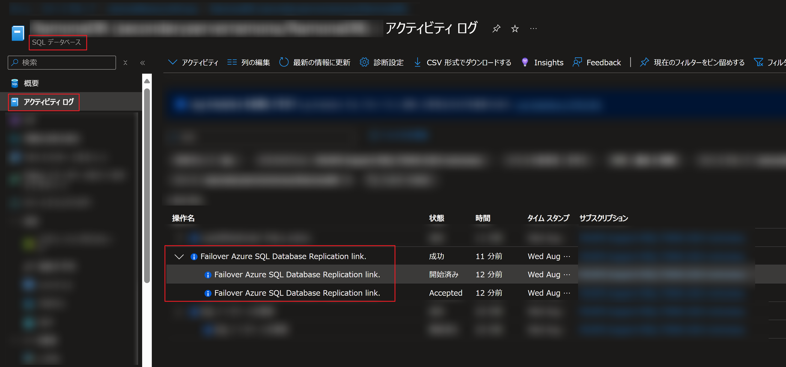
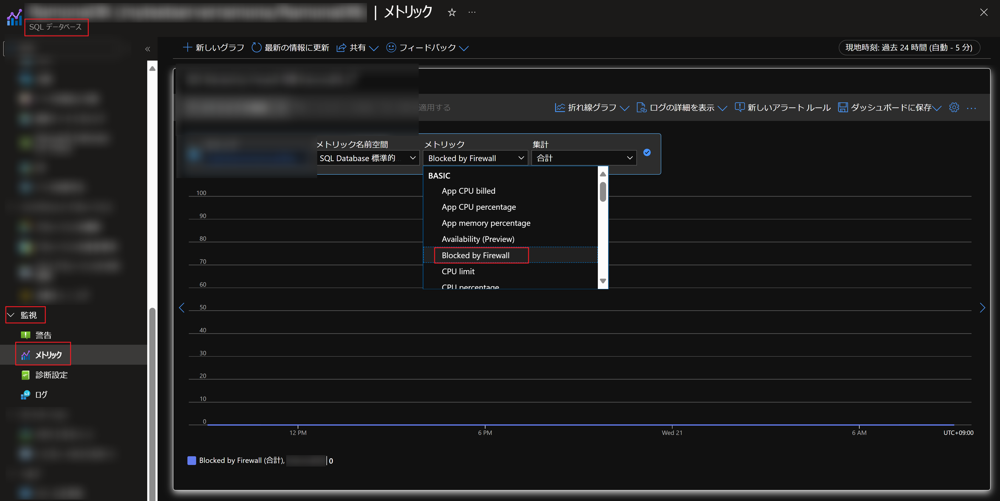
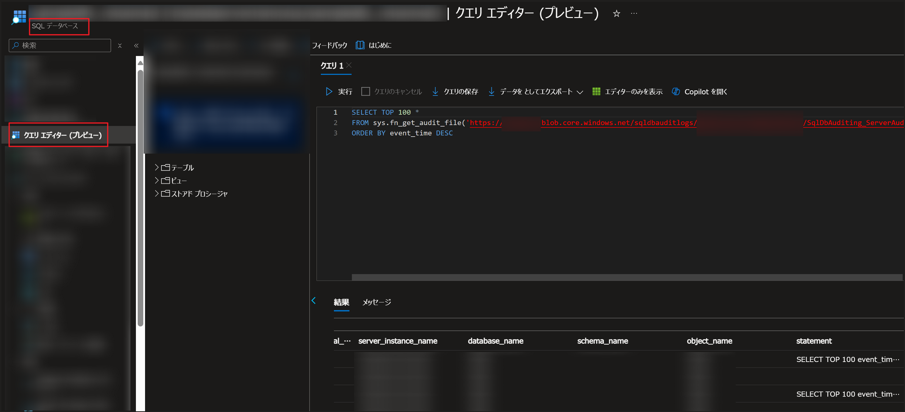
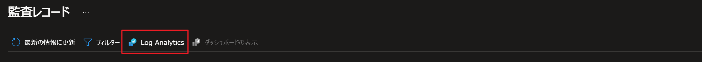
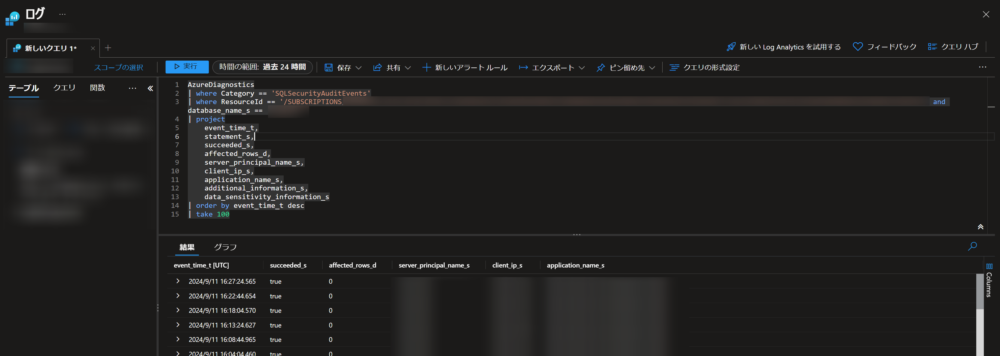

こんにちは。SQL Cloud サポート チームの Ramona Xu です。

今回の投稿では、Azure SQL Database (SQL DB) にて接続エラーが発生した際の初動調査の実施手順をご紹介します。

<!-- more -->

## 目次
---
- [目次](#目次)
- [接続エラーが発生した際の初動調査の実施手順](#接続エラーが発生した際の初動調査の実施手順)
  - [step 1. エラーメッセージの確認](#step-1-エラーメッセージの確認)
  - [step 2. メトリックの確認](#step-2-メトリックの確認)
    - [データベースの接続失敗の確認](#データベースの接続失敗の確認)
    - [データベース側のファイアウォールのブロック状況の確認](#データベース側のファイアウォールのブロック状況の確認)
  - [step 3. 監査ログの確認](#step-3-監査ログの確認)
    - [Azure ストレージに保存された監査ログの確認](#Azure-ストレージに保存された監査ログの確認)
    - [Log Analytics に保存された監査ログの確認](#Log-Analytics-に保存された監査ログの確認)
  - [step 4. 接続エラーのトラブルシューティングについて](#step-4-接続エラーのトラブルシューティングについて)


## 接続エラーが発生した際の初動調査の実施手順
---

### step 1. エラーメッセージの確認
多くの場合データベースから返されるエラーメッセージにエラーの原因が記載されています。  
エラー発生時にクライアント側に返されるデータベースのエラーメッセージのログをご確認することで、問題の正確な把握が容易になります。

例えば 、論理 SQL サーバー側のファイアウォールにて、接続元クライアントのパブリック IP アドレスが許可されていない場合は、以下のようなエラーメッセージがクライアント側に返されます。  
エラーメッセージを読むことで、エラーの原因が特定できます。
```CMD 
Cannot open server 'server_name' requested by the login. Client with IP address '***.***.***.***' is not allowed to access the server. 
To enable access, use the Azure Management Portal or run sp_set_firewall_rule on the master database to create a firewall rule for this IP address or address range. 
It may take up to five minutes for this change to take effect. 
```

### step 2. メトリックの確認
Azure Portal にて、ご利用の SQL DB の「メトリック」からデータベースの利用状況を確認できます。   
メトリックにて、データベースへの接続エラーの発生有無も記録しているため、調査には有用です。
#### データベースの接続失敗の確認
Azure Portalより、Failed Connections メトリックにて、データベースへの接続失敗の有無を確認することができます。

SQL database > 監視 > メトリック > Failed Connections


Failed Connections メトリックには 2 つ種類があり、「Failed Connections: System Errors」 は、メンテナンス時のフェールオーバーや仮想コア数の増減といったスケーリング操作時のように、データベース基盤側に起因して発生した接続失敗を意味します。  
一方、「Failed Connections: User Errors」は、ユーザー名・パスワードの指定間違いや、データベースユーザーの設定不備など、システム起因以外のユーザー側の問題に起因して発生した接続失敗を意味します。

Failed Connections: System Errors に記録がある場合、併せて以下を確認します。
- [リソース正常性](https://learn.microsoft.com/ja-jp/azure/azure-sql/database/resource-health-to-troubleshoot-connectivity?view=azuresql)
- スケーリングが行われたか
  - [アクティビティログ](https://learn.microsoft.com/ja-jp/azure/azure-sql/database/monitoring-sql-database-azure-monitor?view=azuresql#azure-activity-log)で確認する
  - 以下はスケールアップの例
    


- フェールオーバーが行われたか
  - アクティビティログで確認する
  - 以下はユーザーによる手動フェールオーバーの例
  - 


- メンテナンスイベントが行われたか（[メンテナンス期間と事前通知](https://learn.microsoft.com/ja-jp/azure/azure-sql/database/planned-maintenance?view=azuresql#maintenance-windows-and-advance-notifications)を設定している場合）

#### データベース側のファイアウォールによるブロック状況の確認
Azure SQL Database のファイアウォールでは、既定ではすべての接続をブロックし、許可された接続のみアクセスできる方式（ホワイトリスト方式）となっているため、ファイアウォールにて許可されていない接続元からの接続は、ファイアウォールにてブロックされ、メトリックにも記録されます。

SQL database > 監視 > メトリック > Blocked by Firewall
 

### step 3. 監査ログの確認
データベースイベントを追跡する監査ログ（既定では無効）を活用することで、接続エラーの履歴を確認することができます。  
過去の事象でエラーメッセージを確認する場合は、監査ログを活用することも有用です。また監査ログには接続元クライアント IP アドレスや、ホスト名も記録されるため、接続試行が行われたクライアントマシンを確認することもできます。

> [!WARNING]
> Azure portal のメトリックも監査ログもデータベースへ接続が届いていない場合は記録されません。例えば、クライアントマシン側のファイアウォールでブロックされた場合や、名前解決が失敗しデータベースへ通信が届かない場合は、記録されません。

[監査の概要](https://learn.microsoft.com/ja-jp/azure/azure-sql/database/auditing-overview?view=azuresql)  
[監査の設定方法](https://learn.microsoft.com/ja-jp/azure/azure-sql/database/auditing-setup?view=azuresql)  

以下は、監査ログを Azure ストレージ・Log Analytics へ保存した場合の監査ログの確認方法の例です。

#### Azure ストレージに保存された監査ログの確認
Azure ストレージに保存された監査ログは以下の方法で Azure Portal より確認できます。

STEP 1.  ログファイルの URL を確認する
ストレージアカウント > ストレージブラウザー（もしくはデータストレージ "コンテナー"） > BLOBコンテナー > sqldbauditlogs > 該当ファイル名をクリックする > URLをコピーする


STEP 2. 監査ログを確認する
SQLデータベース > クエリエディター > 以下のステートメントを実行する 
Azure portal のクエリエディター以外にも、SQL Server Management Studio（SSMS）からクエリを実行することでも監査ログの内容を確認できます。
※複数のログファイルが存在している場合、ログファイル名を省略した形（「sys.fn_get_audit_file('…/YYYY-MM-DD/', default, default)」）で実行することも可能です。
```sql
SELECT TOP 100 *
FROM sys.fn_get_audit_file('<コピーしたURL>', default, default)
ORDER BY event_time DESC
```


[sys.fn_get_audit_file のドキュメント](https://learn.microsoft.com/ja-jp/sql/relational-databases/system-functions/sys-fn-get-audit-file-transact-sql?view=sql-server-ver16&tabs=sqlserver)

> [!NOTE]
> Azure ストレージに保存された監査ログファイルをローカルマシンにダウンロードし、SSMS から監査ログファイルを読み込み内容を確認することも可能です。

#### Log Analytics に保存された監査ログの確認
Log Analytics に保存された監査ログは以下の方法で Azure Portal より確認できます。
Azure SQL Database の監査ログは、Log Analytics の AzureDiagnostics テーブルに記録され、Category 項目が “SQLSecuriyAuditEvents” となります。 

SQL データベース > セキュリティ > 監査 > 監査ログの表示


Log Analytics


クエリが自動で生成されます。KQL クエリを修正して、取得した情報を絞ったりフィルターを行ったりすることも可能です。
※Log Analytics ワークスペースのリソース画面の "ログ" ページからもログクエリ（KQL）を実行できます。


[Log Analytics のドキュメント](https://learn.microsoft.com/ja-jp/azure/azure-monitor/logs/log-analytics-tutorial)

### step 4. 接続エラーのトラブルシューティングについて 
接続エラーが解消しない場合のトラブルシューティング方法は過去の記事にて紹介しています。
以下の記事も併せてご参照ください。
[接続エラーのトラブルシューティングに関して](https://jp-azuresql.github.io/blog/Connectivity/connectivity-troubleshooting/) 
