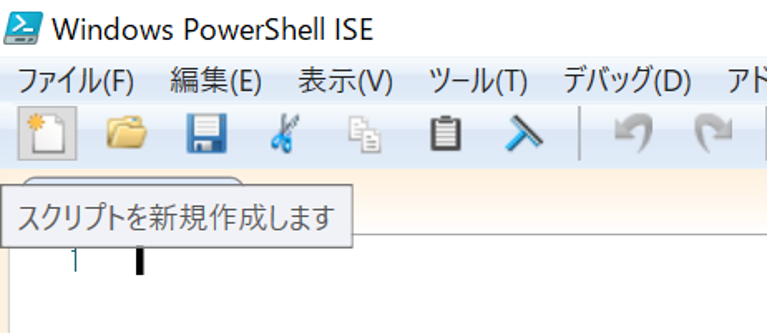
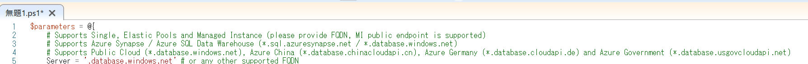
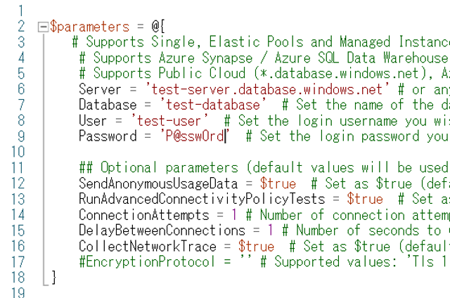
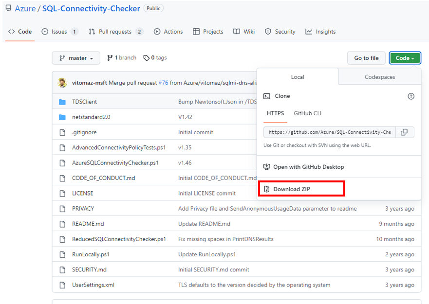
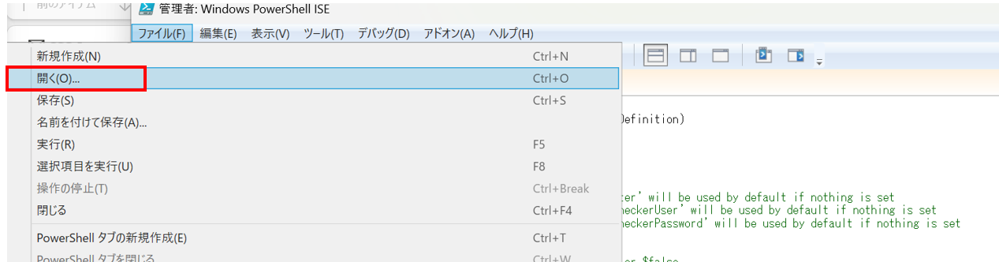
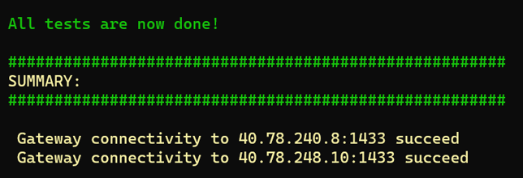
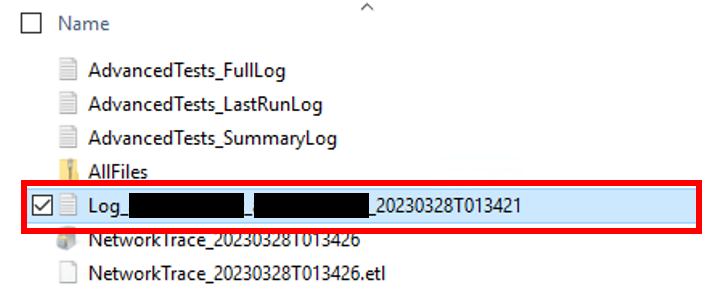
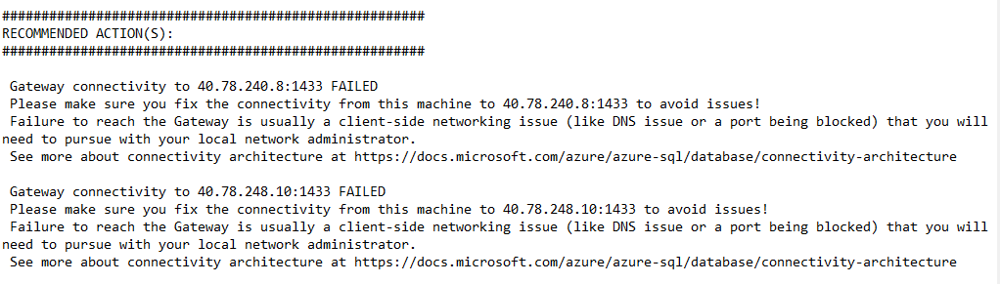

こんにちは。SQL Cloud サポート チームの川野辺です。

今回の投稿では、Azure SQL Database (SQL DB)、SQL Managed Instance (SQL MI) における接続エラーのトラブルシューティングとして、Azure SQL Connectivity Checker のご利用方法に関してご案内します。

<!-- more -->

## Azure SQL Connectivity Checker とは
---

Azure SQL Connectivity Checker とは、指定した SQL DB、SQL MI に対して接続テストを行い、接続に必要な TCP ポートの解放の有無、名前解決の可否などを明らかにできるツールとなります。
そのため、適切に構成したつもりなのに SQL DB へ接続できない、特定のクライアントからのみ SQL MI に接続できないなどの接続に関する問題の解決に有効です。

[Azure SQL Connectivity Checker](https://github.com/Azure/SQL-Connectivity-Checker)


特に、Error: 10060 のように、エラーメッセージからは接続が確立できなかったことしか明らかでない接続エラーが発生した際に、問題の切り分けとして有効です。

>A network-related or instance-specific error occurred while establishing a connection to SQL Server. The server was not found or was not accessible. Verify that the instance name is correct and that SQL Server is configured to allow remote connections. (provider: TCP Provider, error: 0 - A connection attempt failed because the connected party did not properly respond after a period of time, or established connection failed because connected host has failed to respond.) (Microsoft SQL Server, Error: 10060)

[SQL Server への接続を確立している間に、ネットワーク関連またはインスタンス固有のエラーが発生しました](https://learn.microsoft.com/ja-jp/troubleshoot/sql/database-engine/connect/network-related-or-instance-specific-error-occurred-while-establishing-connection)


## 実施方法 Windows 環境のクライアント
---

1. 対象クライアントにて PowerShell を [管理者として実行] で起動します。
スクリプトを新規作成します。



2. 以下スクリプトをコピー&ペーストし、Server, Database, User, Password を環境に合わせて変更ください。



なお、スクリプトの実行中 [raw.githubusercontent.com] からファイルのダウンロードのため HTTPS リクエストが発生します。
ファイアウォール等でインターネットへのアクセスに制限をかけておりましたら許可するよう対応をお願いいたします。


```CMD
$parameters = @{
   # Supports Single, Elastic Pools and Managed Instance (please provide FQDN, MI public endpoint is supported)
    # Supports Azure Synapse / Azure SQL Data Warehouse (*.sql.azuresynapse.net/ *.database.windows.net)
    # Supports Public Cloud (*.database.windows.net), Azure China (*.database.chinacloudapi.cn), Azure Germany (*.database.cloudapi.de) and Azure Government (*.database.usgovcloudapi.net)
    Server = '.database.windows.net' # or any other supported FQDN
    Database = ''  # Set the name of the database you wish to test, 'master' will be used by default if nothing is set
    User = ''  # Set the login username you wish to use, 'AzSQLConnCheckerUser' will be used by default if nothing is set
    Password = ''  # Set the login password you wish to use, 'AzSQLConnCheckerPassword' will be used by default if nothing is set
 
    ## Optional parameters (default values will be used if omitted)
    SendAnonymousUsageData = $true  # Set as $true (default) or $false
    RunAdvancedConnectivityPolicyTests = $true  # Set as $true (default) or $false, this will load the library from Microsoft's GitHub repository needed for running advanced connectivity tests
    ConnectionAttempts = 1 # Number of connection attempts while running advanced connectivity tests
    DelayBetweenConnections = 1 # Number of seconds to wait between connection attempts while running advanced connectivity tests
    CollectNetworkTrace = $true  # Set as $true (default) or $false
    #EncryptionProtocol = '' # Supported values: 'Tls 1.0', 'Tls 1.1', 'Tls 1.2'; Without this parameter operating system will choose the best protocol to use
}
 
$ProgressPreference = "SilentlyContinue";
if ("AzureKudu" -eq $env:DOTNET_CLI_TELEMETRY_PROFILE) {
    $scriptFile = '/ReducedSQLConnectivityChecker.ps1'
} else {
    $scriptFile = '/AzureSQLConnectivityChecker.ps1'
}
$scriptUrlBase = 'https://raw.githubusercontent.com/Azure/SQL-Connectivity-Checker/master'
cls
Write-Host 'Trying to download the script file from GitHub (https://github.com/Azure/SQL-Connectivity-Checker), please wait...'
try {
    [Net.ServicePointManager]::SecurityProtocol = [Net.SecurityProtocolType]::Tls12 -bor [Net.SecurityProtocolType]::Tls11 -bor [Net.SecurityProtocolType]::Tls
    Invoke-Command -ScriptBlock ([Scriptblock]::Create((Invoke-WebRequest ($scriptUrlBase + $scriptFile) -UseBasicParsing -TimeoutSec 60).Content)) -ArgumentList $parameters
    }
catch {
    Write-Host 'ERROR: The script file could not be downloaded:' -ForegroundColor Red
   $_.Exception
    Write-Host 'Confirm this machine can access https://github.com/Azure/SQL-Connectivity-Checker/' -ForegroundColor Yellow
    Write-Host 'or use a machine with Internet access to see how to run this from machines without Internet. See how at https://github.com/Azure/SQL-Connectivity-Checker/' -ForegroundColor Yellow
}
#end
```

例：変更箇所 Server, Database, User, Password は以下の様に設定ください。




3. スクリプトを実行します。


4. 下記のようなメッセージが出力され、実行が終了します。
出力されたパスに接続テストツールの結果ファイルが出力されます。

>Log file can be found at C:\Users\user001\AppData\Local\Temp\AzureSQLConnectivityCheckerResults\20210209T021953
>A zip file with all the files can be found at C:\Users\user001\AppData\Local\Temp\AzureSQLConnectivityCheckerResults\20210209T021953/AllFiles.zip


## 実施方法 ネットワークアクセスが制限されている場合
---

クライアントにてネットワークアクセスが制限されている場合も、インターネットアクセスが可能な端末でファイルをダウンロードし、対象クライアントに渡すことで、Azure SQL Connectivity Checker を実施いただけます。
 
1. 以下の URL に接続し、[Download ZIP] を選択ください。

https://github.com/Azure/SQL-Connectivity-Checker



2. ダウンロードされたファイル [SQL-Connectivity-Checker-master.zip] を調査対象クライアントに移動させ、全てのファイルを解凍ください。

3. PowerShell を管理者として実行いただき、[ファイル] – [開く] から [RunLocally.ps1] を選択し、Server, Database, User, Password をお客様の環境に合わせて変更ください。



3. スクリプトを実行します。

4. 下記のようなメッセージが出力され、実行が終了します。
出力されたパスに接続テストツールの結果ファイルが出力され、問題点を確認した場合はそちらに表示されます。

>Log file can be found at C:\Users\user001\AppData\Local\Temp\AzureSQLConnectivityCheckerResults\20210209T021953
>A zip file with all the files can be found at C:\Users\user001\AppData\Local\Temp\AzureSQLConnectivityCheckerResults\20210209T021953/AllFiles.zip

詳細はこちらにもございますので、必要に応じてご確認ください。
[How to run this from machines without Internet access](https://github.com/Azure/SQL-Connectivity-Checker#how-to-run-this-from-machines-without-internet-access)


## 実施方法　Linux 環境のクライアント
---

Linux 環境からも、PowerShell をインストールすることで、Azure SQL Connectivity Checker を実施可能です。


1. Linux 環境上に PowerShell がインストールされていなければ、以下の URL よりインストールください。
https://docs.microsoft.com/powershell/scripting/install/installing-powershell-core-on-linux

2. ターミナルより pwsh を起動ください。

3. 以下のコマンドの Server, Database, User, Password をお客様の環境に合わせて変更し、実行ください。

```CMD
$parameters = @{
    # Supports Single, Elastic Pools and Managed Instance (please provide FQDN, MI public endpoint is supported)
    # Supports Azure Synapse / Azure SQL Data Warehouse (*.sql.azuresynapse.net / *.database.windows.net)
    # Supports Public Cloud (*.database.windows.net), Azure China (*.database.chinacloudapi.cn), Azure Germany (*.database.cloudapi.de) and Azure Government (*.database.usgovcloudapi.net)
    Server = '.database.windows.net' # or any other supported FQDN
    Database = ''  # Set the name of the database you wish to test, 'master' will be used by default if nothing is set
    User = ''  # Set the login username you wish to use, 'AzSQLConnCheckerUser' will be used by default if nothing is set
    Password = ''  # Set the login password you wish to use, 'AzSQLConnCheckerPassword' will be used by default if nothing is set

    ## Optional parameters (default values will be used if omitted)
    SendAnonymousUsageData = $true  # Set as $true (default) or $false
    RunAdvancedConnectivityPolicyTests = $true  # Set as $true (default) or $false, this will load the library from Microsoft's GitHub repository needed for running advanced connectivity tests
    ConnectionAttempts = 1 # Number of connection attempts while running advanced connectivity tests
    DelayBetweenConnections = 1 # Number of seconds to wait between connection attempts while running advanced connectivity tests
    CollectNetworkTrace = $true  # Set as $true (default) or $false
    #EncryptionProtocol = '' # Supported values: 'Tls 1.0', 'Tls 1.1', 'Tls 1.2'; Without this parameter operating system will choose the best protocol to use
}

$ProgressPreference = "SilentlyContinue";
if ("AzureKudu" -eq $env:DOTNET_CLI_TELEMETRY_PROFILE) {
    $scriptFile = '/ReducedSQLConnectivityChecker.ps1'
} else {
    $scriptFile = '/AzureSQLConnectivityChecker.ps1'
}
$scriptUrlBase = 'https://raw.githubusercontent.com/Azure/SQL-Connectivity-Checker/master'
cls
Write-Host 'Trying to download the script file from GitHub (https://github.com/Azure/SQL-Connectivity-Checker), please wait...'
try {
    [Net.ServicePointManager]::SecurityProtocol = [Net.SecurityProtocolType]::Tls12 -bor [Net.SecurityProtocolType]::Tls11 -bor [Net.SecurityProtocolType]::Tls
    Invoke-Command -ScriptBlock ([Scriptblock]::Create((Invoke-WebRequest ($scriptUrlBase + $scriptFile) -UseBasicParsing -TimeoutSec 60).Content)) -ArgumentList $parameters
    }
catch {
    Write-Host 'ERROR: The script file could not be downloaded:' -ForegroundColor Red
    $_.Exception
    Write-Host 'Confirm this machine can access https://github.com/Azure/SQL-Connectivity-Checker/' -ForegroundColor Yellow
    Write-Host 'or use a machine with Internet access to see how to run this from machines without Internet. See how at https://github.com/Azure/SQL-Connectivity-Checker/' -ForegroundColor Yellow
}
#end
```

4. テストの完了後、以下のように接続テストの結果が表示されますので、こちらをご確認ください。




詳細はこちらにもございますので、必要に応じてご確認ください。
[Run from Linux](https://github.com/Azure/SQL-Connectivity-Checker#run-from-linux)


## 出力結果の確認方法
---

Azure SQL Connectivity Checker の実行後には、自動でログがファイルに出力されます。
実施結果に関しては、以下のスクリーンショットのように [Log_~] の形式のファイルに出力され、こちらの [SUMMARY] にテスト結果、 適切に構成されていない場合は [RECOMMENDED ACTION(S)] に推奨事項が記載されます。



例えば、接続に必要である 1433 ポートが解放されていない場合、以下のスクリーンショットのように、[RECOMMENDED ACTION(S)] に 1433 FAILED と出力され、こちらの設定の見直しに関してご案内があります。

