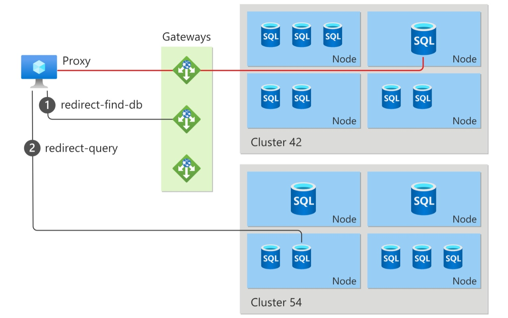
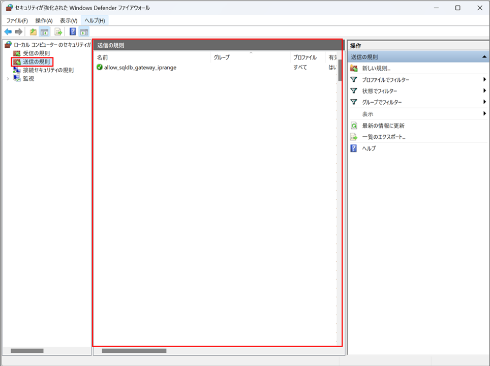

こんにちは。SQL Cloud サポート チームの宮崎です。

今回の投稿では、Azure SQL Database (SQL DB) において、2023 年 8 月 31 日以降に実施予定のゲートウェイ IP アドレスの移行（追跡 ID - FK_B-9T8 / WS_W-1T0 等）の概要とユーザー側での対応の要否、対処方法について説明します。

<!-- more -->

## Azure SQL Database ゲートウェイ IP アドレス移行の概要
---

SQL DB の接続アーキテクチャでは、アプリケーションから SQL DB へ接続する際に Azure 内部のゲートウェイを経由します。

今回の追跡 ID （FK_B-9T8/WS_W-1T0 等）の通知は、この度このゲートウェイの IP アドレスが追加されることにより、アプリケーションが動作するクライアントマシンのファイアウォールや仮想ネットワークのネットワークセキュリティグループ（NSG）にて通信の送受信を制限している場合、その制限ルールによっては変更後のゲートウェイへの通信がブロックされてしまうため、ユーザー側で新しいゲートウェイの IP アドレスへの通信を許可する必要がある、という内容です。

> [!NOTE]
> 今回のゲートウェイ IP の移行は、特定の SQL DB リソースのみではなく、すべての SQL Database が対象となります。

## ユーザー側の対応の要否と対処方法について
---

### 対応が必要な通信経路

アプリケーションから SQL DB に接続する場合、以下の 3 つの経路（接続方式）があります。

A. パブリックネットワークアクセス
B. 仮想ネットワークからサービスエンドポイント経由の接続
C. プライベートエンドポイント経由でのプライベート接続

今回通知の影響を受ける接続方式は、A と B のみとなります。

> [!IMPORTANT]
> プライベートエンドポイント接続のみをご利用の場合は、当該通知による影響の対象外となりユーザー側での対応は不要です。
> アプリケーションからプライベートエンドポイントへの接続となり、プライベートエンドポイントからゲートウェイへの通信制御は Azure 内部で行われるためです。

### ゲートウェイへの通信可否の確認方法と対処方法

当該通知に関してユーザー側で対応が必要かどうかに関しては、SQL DB へ接続を行うアプリケーション（クライアントマシン）のネットワーク設定や仮想ネットワーク/サブネットのネットワークセキュリティグループ（NSG）のアウトバウンド通信ルール、OS のファイアウォールルールなどを確認します。
以下ドキュメントに記載の対象リージョン（使用している SQL DB が存在するリージョン）のゲートウェイ IP アドレスとゲートウェイ IP アドレスのサブネットレンジすべてへの通信が行える状態になっているか（ファイアウォールのアウトバウンド通信制御にてゲートウェイアドレスへの通信がブロックされる設定になっていないか等）を確認する必要があります。

[Gateway IP addresses](https://learn.microsoft.com/en-us/azure/azure-sql/database/connectivity-architecture?view=azuresql-db#gateway-ip-addresses)

※2023/08/01 現在、日本語のドキュメントでは一部ゲートウェイ IP アドレス/ゲートウェイ IP アドレスのサブネットレンジが更新されておりません。
そのため、ゲートウェイ IP アドレスの確認は、上記原文の英語ドキュメントをご参照ください。原文のドキュメントは URL の言語箇所が /en-us/ となり、日本語は /ja-jp/ です。

以下東日本リージョンのゲートウェイ IP アドレスとゲートウェイ IP アドレス サブネットレンジの抜粋

|  Region name  |  Gateway IP addresses  |  Gateway IP address subnets  |
| ------------- | ---------------------- | ---------------------------- |
|  Japan East   |  40.79.184.8, 40.79.192.5,  13.78.104.32, 40.79.184.32  |  13.78.104.32/29, 40.79.184.32/29,  40.79.192.32/29, 20.191.165.160/27  |

以下西日本リージョンのゲートウェイ IP アドレスとゲートウェイ IP アドレス サブネットレンジの抜粋

|  Region name  |  Gateway IP addresses  |  Gateway IP address subnets  |
| ------------- | ---------------------- | ---------------------------- |
|  Japan West   |  104.214.148.156, 40.74.97.10 |  40.74.96.32/29, 20.18.179.192/29,   20.189.225.160/27  |

> [!NOTE]
> 上記ドキュメントに記載のゲートウェイアドレス/サブネットに関して、現時点ではまだ稼働していないゲートウェイのアドレス（今後利用予定のアドレス）もあるため、Test-NetConnection 等のゲートウェイアドレスに対する疎通確認コマンドにてすべてのゲートウェイアドレスへの通信可否を確認することはできません。
> そのため、アプリケーション側のネットワーク、ファイアウォールの設定を確認する必要があります。

#### NSG ルール

NSG のアウトバウンド通信設定を確認する場合は、Azure portal より該当の NSG の「送信セキュリティ規則」画面から、設定されているルールを確認します。
SQL DB のゲートウェイへのアウトバウンド通信がブロックされるような Deny ルールがある場合は、より高い優先度（優先度の値が低い）で、すべての SQL DB のゲートウェイ IP アドレスとゲートウェイ IP アドレスのサブネットレンジへの通信を許可するルールを追加します。

> [!IMPORTANT]
> NSG の送信セキュリティ規則にて、SQL DB（ゲートウェイ）への通信の宛先にサービスタグ Sql.<リージョン> を設定している場合は NSG のルールの変更や追加は不要です。
> サービスタグ Sql.<リージョン> には、該当リージョンのすべてのゲートウェイ IP アドレスとゲートウェイ IP アドレスのサブネットレンジが含まれています。

#### アプリケーション側（クライアントマシン）にインストールされたファイアウォールソフト

アプリケーション側（クライアントマシン）の OS 上にインストールされたファイアウォールソフトに関しては、使用しているソフトによって設定が異なるため、確認方法はソフトウェア提供ベンダーに確認ください。

参考までに、Windows Defender のファイアウォールを使用している場合、Windows Defender のファイアウォール画面から「詳細設定」より、「送信の規則」にて現在の送信規則を確認できます。
SQL DB のゲートウェイへのアウトバウンド通信がブロックされるような Block ルールがある場合は、すべての SQL DB のゲートウェイ IP アドレスとゲートウェイ IP アドレスのサブネットレンジへの通信を許可するルールを設定ください。

> [!NOTE]
> ゲートウェイへの通信ルールの宛先ポートは「TCP 1433 ポート」となります。

キーワード：#ゲートウェイ移行 #トラフィック移行 #パブリックアドレス変更 #FK_B-9T8 #WS_W-1T0
