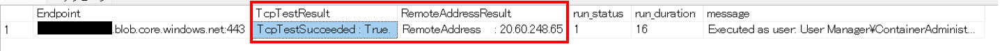

---
title: SQL Managed Instance からストレージアカウントやリンクサーバーへの接続テスト方法
date: 2023-05-17 15:00:00
tags:
  - Connectivity
  - Troubleshooting
  - SQL Managed Instance
---

こんにちは。SQL Cloud サポート チームの川野辺です。

今回の投稿では、SQL Managed Instance (SQL MI) から、ストレージアカウントやリンクサーバーに接続できない場合の接続テスト方法に関してご案内します。

<!-- more -->

## 実施手順
---

SQL MI はサブネット内にデプロイされるため、BULK INSERT などでストレージアカウントやリンクサーバーで異なる SQL MI などの外部リソースにアクセスを行う場合、サブネット内の SQL MI からの接続を許可するようにネットワークの構成を設定する必要があります。
その際、当該 SQL MI から外部リソースへの接続可否、および、名前解決結果を確認するため、以下の手順を活用いただけます。
なお、以下では PowerShell の Test-NetConnection コマンドレットを呼び出すジョブを SQL Managed Instance に作成し実行することで、実際に SQL MI から外部リソースへの接続可否、および、名前解決結果を確認します。

1. 対象インスタンスに接続します。

2. 以下のコマンドの @endpoint に接続対象のエンドポイント (以下の例ではストレージアカウントの myaccount1.blob.core.windows.net) を指定し、スクリプトを実行ください。
@port には、BULK INSERT などを目的にストレージアカウントに接続する際には 443 ポート、リンクサーバーに対するテストは 1433 ポートを指定してください。

| 接続テスト先          | Port  |
| ------------------- | ----|
| ストレージアカウント   | 443   |
| リンクサーバー        | 1433  |

以下にご案内しているスクリプトは、こちらで管理されておりますので、必要に応じてご参照ください。
https://github.com/Azure/sqlmi/blob/main/how-to/how-to-test-tcp-connection-from-mi/TestTCPNetworkConnection.sql

```CMD
--START
-- Parameters
DECLARE @endpoint NVARCHAR(512) = N'myaccount1.blob.core.windows.net'
DECLARE @port NVARCHAR(5) = N'443'

--Script
DECLARE @jobName NVARCHAR(512) = N'TestTCPNetworkConnection', @jobId BINARY(16), @cmd NVARCHAR(MAX)
IF EXISTS (SELECT job_id FROM msdb.dbo.sysjobs_view WHERE name = @jobName)
EXEC msdb.dbo.sp_delete_job @job_name=@jobName, @delete_unused_schedule=1
EXEC msdb.dbo.sp_add_job @job_name=@jobName, @enabled=1, @job_id = @jobId OUTPUT
DECLARE @stepName NVARCHAR(512) = @endpoint + N':' + @port
SET @cmd = (N'tnc ' + @endpoint + N' -port ' + @port +' | select ComputerName, RemoteAddress, TcpTestSucceeded | Format-List')
EXEC msdb.dbo.sp_add_jobstep @job_id=@jobId, @step_name=@stepName
, @step_id=1, @cmdexec_success_code=0, @subsystem=N'PowerShell', @command=@cmd, @database_name=N'master'

EXEC msdb.dbo.sp_add_jobserver @job_id = @jobId, @server_name = N'(local)'
EXEC msdb.dbo.sp_start_job @job_name=@jobName

--Check status every 5 seconds
DECLARE @RunStatus INT 
SET @RunStatus=10
WHILE ( @RunStatus >= 4)
BEGIN
SELECT distinct @RunStatus  = run_status
FROM [msdb].[dbo].[sysjobhistory] JH JOIN [msdb].[dbo].[sysjobs] J ON JH.job_id= J.job_id 
WHERE J.name=@jobName and step_id = 0
WAITFOR DELAY '00:00:05'; 
END

--Get logs once job completes
SELECT [step_name] AS [Endpoint]
,SUBSTRING([message], CHARINDEX('TcpTestSucceeded',[message]), CHARINDEX('Process Exit',[message])-CHARINDEX('TcpTestSucceeded',[message])) as TcpTestResult
,SUBSTRING([message], CHARINDEX('RemoteAddress',[message]), CHARINDEX('TcpTestSucceeded',[message])-CHARINDEX('RemoteAddress',[message])) as RemoteAddressResult
,[run_status] ,[run_duration], [message]
FROM [msdb].[dbo].[sysjobhistory] JH JOIN [msdb].[dbo].[sysjobs] J ON JH.job_id= J.job_id
WHERE J.name=@jobName and step_id <> 0
--END
```

## 出力結果の確認方法
---

上記のコマンドを実行すると、以下のような出力結果が得られます。こちらのスクリーンショットでは、ストレージアカウントへの接続テストの結果を紹介しています。
TcpTestSucceeded : True が想定される結果となりますが、False となっていた場合、TCP レベルでの接続が失敗していることを示します。そのため、ネットワークセキュリテイグループ (NSG) やルートテーブルの見直しを実施ください。
また、RemoteAddressResult には、接続先のエンドポイントに対する名前解決の結果が表示されます。こちらの結果が得られない場合や想定される結果でない場合は、名前解決の設定が適切でない場合がありますので、DNS サーバーなどの見直しを実施ください。




## 参考情報
---

こちらの内容は、以下のブログ記事を参考に作成しています。

https://techcommunity.microsoft.com/t5/azure-sql-blog/how-to-test-tcp-connectivity-from-a-sql-managed-instance/ba-p/3058458
