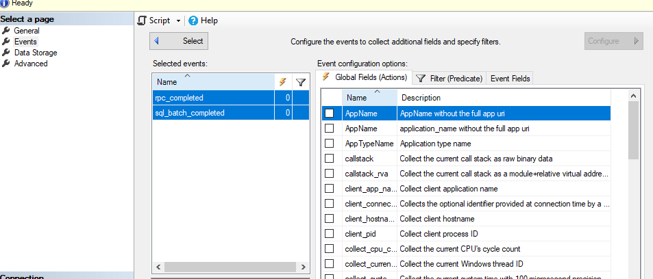

---
title: SQL Managed Instance における拡張イベントの採取方法 
date: 2025-01-24 17:00:00 
tags: 
 - SQL Managed Instance 
 - Management 
 - xevent
--- 

こんにちは。SQL Cloud サポート チームの太田です。 
今回の投稿では、SQL Managed Instance (SQL MI)における拡張イベントの採取方法についてご案内します。 

<!-- more --> 
##　拡張イベント(Extended Events)とは 

拡張イベントは、SQL Managed Instance データベースエンジンに組み込まれているデータベースのパフォーマンス監視やトラブルシューティングに有用なツールです。例えば、クエリの実行時間やデッドロックの発生状況など、特定のイベントデータを収集することができます。 

<関連ドキュメント> 
[拡張イベントの概要](https://learn.microsoft.com/ja-jp/sql/relational-databases/extended-events/extended-events?view=sql-server-ver16) 

## 拡張イベントの設定方法 
**1. SAS (Shared Access Signature) の取得** 
該当のストレージアカウントの [Shared Access Signature] の画面より、リソースの種類と時刻を設定します。 
その後、[SAS と接続文字列を生成する] を選択し、生成された[SAS トークン]を控えておきます。 


**2. クレデンシャルの作成** 
以下の T-SQL の <> 内をご自身のストレージアカウント下のコンテナの URI、SAS トークンに変更します（<> は不要です）。SAS トークンは ? を除く sv から始まる部分を記載してください。 
 


その後、SQL Server Management Studio (以降 SSMS) から、SQL MI の master データベースに対して以下のクエリを実行します。 

```sql 
IF EXISTS 
 (SELECT * FROM sys.credentials WHERE name = '<ストレージアカウントコンテナ URI>') 
BEGIN 
 DROP CREDENTIAL [<ストレージアカウントコンテナ URI>] ; 
END 
GO 

CREATE CREDENTIAL [<ストレージアカウントコンテナ URI>]
WITH IDENTITY='SHARED ACCESS SIGNATURE',
SECRET = '<SAS トークン>' 
``` 

実行例） 
ストレージアカウントコンテナ URI：https://myblogstorage.blob.core.windows.net/myfolder 
SAS トークン：sv=2018-03-28&ss=bfqt&srt=sco&sp=rwdlacup&se=2019-07-23T23:29:33Z&st=2019-07-09T15:29:33Z&spr=https&sig=...%%3D 

```sql 
IF EXISTS 
 (SELECT * FROM sys.credentials WHERE name = 'https://myblogstorage.blob.core.windows.net/myfolder') 
BEGIN 
 DROP CREDENTIAL [https://myblogstorage.blob.core.windows.net/myfolder] ; 
END 
GO 

CREATE CREDENTIAL [https://myblogstorage.blob.core.windows.net/myfolder] 
WITH IDENTITY='SHARED ACCESS SIGNATURE', 
SECRET = 'sv=2018-03-28&ss=bfqt&srt=sco&sp=rwdlacup&se=2019-07-23T23:29:33Z&st=2019-07-09T15:29:33Z&spr=https&sig=...%%3D' 
``` 

**3. 拡張イベントの作成** 
以下のクエリを実行してください。filename については該当のストレージアカウントを指定ください。以下はサンプルのクエリとなりますので、取得したいイベントに合わせて設定してください。 

2025 年 1 月現在 SSMS GUI ではストレージアカウントを出力先とする拡張イベントセッションは作成できませんので、SSMS GUI を使用して拡張イベントセッションを定義したい場合は、以下をテンプレートとして一旦拡張イベントセッションを作成し、その後作成された拡張イベントセッションを SSMS GUI で開いて編集してください。

```sql 
CREATE EVENT SESSION [01Xevent] ON SERVER  
ADD EVENT sqlserver.rpc_completed( 
 ACTION(package0.event_sequence,sqlserver.client_app_name,sqlserver.client_hostname,sqlserver.database_name,sqlserver.query_hash,sqlserver.query_plan_hash,sqlserver.request_id,sqlserver.session_id,sqlserver.sql_text,sqlserver.username)), 
ADD EVENT sqlserver.sql_batch_completed( 
 ACTION(package0.event_sequence,sqlserver.client_app_name,sqlserver.client_hostname,sqlserver.database_name,sqlserver.query_hash,sqlserver.query_plan_hash,sqlserver.request_id,sqlserver.session_id,sqlserver.sql_text,sqlserver.username)) 
ADD TARGET package0.asynchronous_file_target( 
SET filename='<ストレージアカウントコンテナ URI>/XEvent1.xel') 
WITH (MAX_MEMORY=4096 KB,EVENT_RETENTION_MODE=ALLOW_SINGLE_EVENT_LOSS,MAX_DISPATCH_LATENCY=30 SECONDS,MAX_EVENT_SIZE=0 KB,MEMORY_PARTITION_MODE=NONE,TRACK_CAUSALITY=ON,STARTUP_STATE=OFF) 
``` 

> [!IMPORTANT]
> Global Fields の設定を忘れないでください。Global Fields を取得対象としていないことで、採取した拡張イベントが無駄なものになってしまう可能性があります。
> 以下については必ず追加してください。
>
> | Global Field                      |  説明  |
> |-----------------------------------|-----------------------------------------------------------------------|
> | database_id または database_name  | どのデータベースで行われた処理なのかが分からなくてもいい場合を除いて必須です。 |
> | event_sequence                    | 必須です。同時刻に複数のイベントが発生することはよくありますが、そのような場合にイベントの発生順を知るために必要です。|
> | session_id                        | 必須です。特定のセッションが実行した処理の一連の流れを確認する場合に必要になります。|
>
> その他にも、拡張イベントの採取目的にとって有用なフィールドがある可能性がありますので、すべてのフィールドに関してその必要性を確認してください。
> 特に以下のフィールドは、必要となる場面が多くあります。
>
> | Global Field                      |  説明  |
> |-----------------------------------|-----------------------------------------------------------------------|
> | query_hash, query_plan_hash       | クエリパフォーマンス調査を行う場合には必須です。クエリストアの情報とのマッピングが可能となります。|
> | server_principal_name             | 誰が実行したのかを知る必要がある場合には必須です。|
> | sql_text                          | イベント発生時に実行されていたクエリを確認したい場合には必須です。|
> | transaction_id                    | ロックの獲得や待機などトランザクションの状況を確認する場合には必須です。|
> 
> なお、SSMS GUI の場合、以下のように追加したすべてのイベントを選択した後に各フィールドにチェックをつけることで、個々のイベントに対してではなく全イベントに対して一括で Global Fields を追加することができます。
>.
> 
> 
>
>.


**4. 拡張イベントの実行** 
以下のクエリを実行してください。拡張イベントセッションが開始され、以下の画像のようにセッションが表示されます。 

```sql 
ALTER EVENT SESSION [01Xevent] ON server STATE = START; 
``` 

 

**5. 拡張イベントの停止**
以下のクエリを実行いただくことで、拡張イベントセッションを停止することができます。 

```sql 
ALTER EVENT SESSION [01Xevent] ON server STATE = STOP; 
``` 

**6. 拡張イベントの確認**
取得した拡張イベントは、指定したストレージアカウントのコンテナーの配下にファイルが作成されます。
こちらをダウンロードすると、SSMS でファイルを開いて中身を確認することが可能です。

 

</BR>
</BR>
</BR>

### 更新履歴
| 更新日 | 更新内容 |
|-------|----------|
|2024-09-27|初回公開|
|2025-01-24|SSMS GUI による拡張イベントセッションの作成および Global Fields に関する記載を追加|

</BR>
</BR>