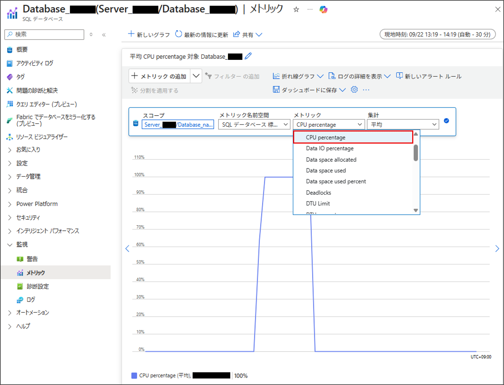

こんにちは。SQL Cloud サポート チームの Uneme です。
今回の投稿では、Azure SQL Database (SQL DB) において DTU 使用率が高騰した際の初動調査の方法を紹介します。

<!-- more -->

## 目次
---
- [目次](#目次)
- [DTU の意味と構成要素](#DTU-の意味と構成要素)
- [Azure portal でのメトリック確認方法 ～高騰した構成要素の特定～](#Azure-portal-でのメトリック確認方法-～高騰した構成要素の特定～)

> [!WARNING]
> 本記事は DTU 購入モデルが対象です。仮想コア購入モデルでは DTU という指標はありません。
> 各モデルの比較や違いは [こちら](https://learn.microsoft.com/ja-jp/azure/azure-sql/database/purchasing-models?view=azuresql) や [こちら](https://learn.microsoft.com/ja-jp/azure/azure-sql/database/service-tiers-dtu?view=azuresql) のドキュメントを参照ください。

## DTU の意味と構成要素
---
DTU（データベース トランザクション ユニット）は、SQL DB のパフォーマンス/スペックを表す指標で、CPU・メモリ・読み取り/書き込み（Data IO と Log IO）のリソースを組み合わせたものです。
DTU 使用率が高騰した場合は、これらのリソース（構成要素）負荷※のうちいずれか、もしくは、複数のリソース負荷が高騰している可能性があります。

> [!WARNING]
> ※DTU にはメモリリソースも含まれますが、DTU 使用率にはメモリ使用率は含まれません。SQL DB ではメモリはデータをキャッシュするために使用され、恒常的にメモリ使用率が高い状態であることが理由です。SQL DB におけるメモリ使用率については [こちら](https://jp-azuresql.github.io/blog/Performance/memory-usage/) のブログ記事で紹介しているので、併せてご参照ください。

DTU 数が多いほど、より多くの計算・I/O リソースが割り当てられ、パフォーマンスが向上します。
DTU 使用率は、以下の 3 つのリソース使用率の中の最大値で算出されます。そのため、DTU 使用率が高騰した場合、どの構成要素の負荷が高いのか調べる必要があります。

**CPU 使用率:**
CPU 使用率とは、割り当てられた CPU リソースに対してどれだけ CPU を使用しているかを指します。

**Data IO 使用率:**
Data IO 使用率とは、データベースがストレージからデータを読み込む際に発生する物理読み取り処理の負荷を指します。

**Log IO 使用率:**
Log IO 使用率とは、データ変更クエリ（INSERT、DELETE、UPDATE 等）により生成されるトランザクションログの書き込み負荷を指します。

[DTU ベースの購入モデルの概要 - DTU 使用率を決定する](https://learn.microsoft.com/ja-jp/azure/azure-sql/database/service-tiers-dtu?view=azuresql#determine-dtu-utilization)

## Azure portal でのメトリック確認方法 ～高騰した構成要素の特定～
---
Azure portal から対象データベースのメトリックを確認することで、CPU 使用率、Data IO 使用率、Log IO 使用率を確認することができます。
以下の手順で DTU 構成要素の使用率をグラフで確認できます。

  1. 対象の SQL DB を選択

  2. 左メニューから「メトリック」を選択

  3. 「メトリック」のプルダウンで「CPU percentage(CPU 使用率)」または「Data IO percentage(Data IO 使用率)」または「Log IO percentage(Log IO 使用率)」を選択

> [!NOTE]
> DTU 使用率の中でどのリソースが高騰しているかを理解することで、正しい調査・対処を行うことができます。

キーワード：#リソース使用率高騰 #トラブルシューティングガイド #データベース #初期調査