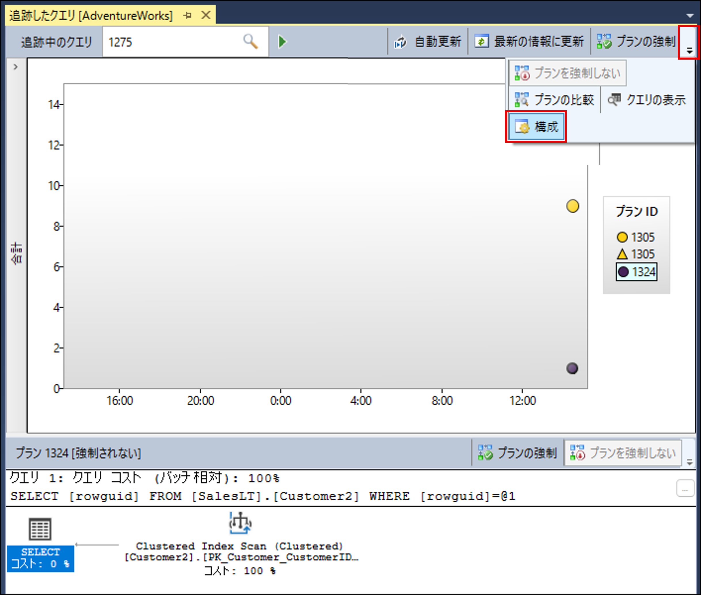
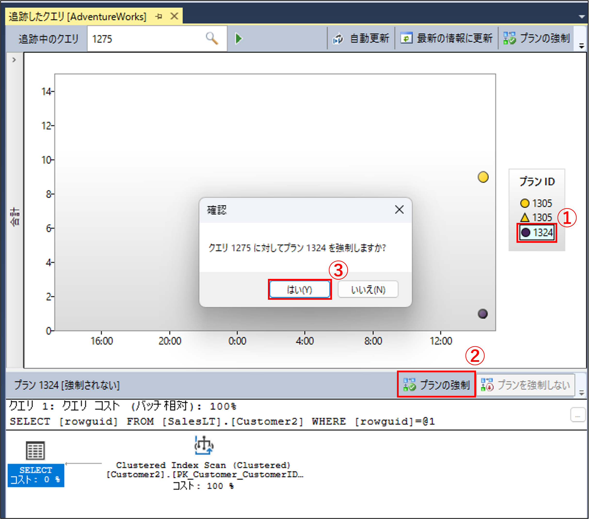
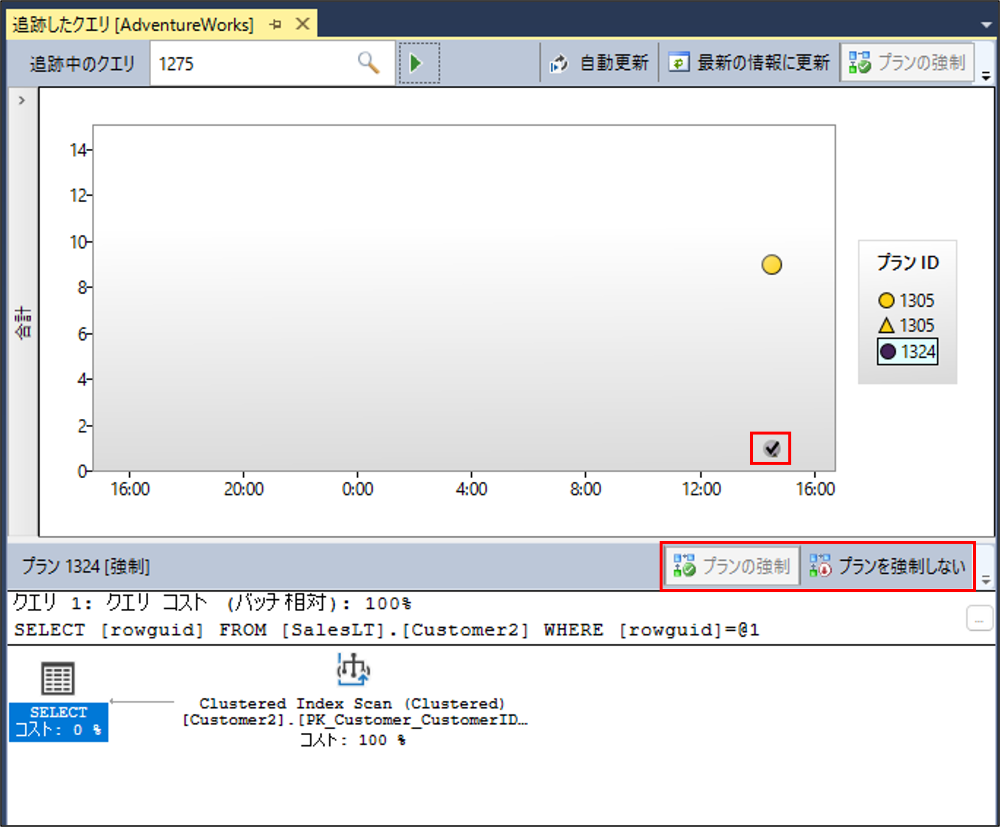

SQL Cloud サポート チームの宮崎です。

今回の投稿では、Azure SQL Database (SQL DB)、SQL Managed Instance (SQL MI) における、実行プラン強制の注意点と手順について紹介します。

<!-- more -->

## 目次
---
- [目次](#目次)
- [実行プランの強制とは](#実行プランの強制とは)
- [実行プラン強制の仕組み](#実行プラン強制の仕組み)
- [実行プラン強制のメリットと注意点](#実行プラン強制のメリットと注意点)
- [実行プランの強制方法](#実行プランの強制方法)
  - [A：クエリストア内のプランを用いて実行プラン強制を行う方法](#A：クエリストア内のプランを用いて実行プラン強制を行う方法)
  - [B：クエリヒント句を用いて実行プラン強制を行う方法](#B：クエリヒント句を用いて実行プラン強制を行う方法)
- [実行プラン強制のトラブルシューティング](#実行プラン強制のトラブルシューティング)

## 実行プランの強制とは
---
SQL DB、SQL MI では、クエリを実行する際にクエリテキストがコンパイルされ実行プランを生成し、実行プランの内容に従いクエリを実行する仕組みとなります（メモリ上にプランキャッシュが存在する場合は、キャッシュされたプランが再利用されます）。
同一のクエリテキストであっても実行プランが異なることでパフォーマンスに差が生じることがあり、実行プランの強制を行うことでプラン変更によるクエリパフォーマンスの低下を容易に解決できる場合があります。

ただし、パフォーマンスが低下したからプランを強制すればよいというものでもなく、メリットとデメリットを理解したうえで使用する必要があります。

> [!NOTE]
> 実行プランはクエリの実行順序やアルゴリズムを定義するものです。
> 実行プランについては [ドキュメント「実行プランの概要」](https://learn.microsoft.com/ja-jp/sql/relational-databases/performance/execution-plans?view=sql-server-ver16) や [ブログ記事「実行プランの確認方法」](https://jp-azuresql.github.io/blog/Performance/show-execution-plan/) にて紹介しています。

## 実行プラン強制の仕組み
---
実行プランの強制では、ストレージ（クエリストア）に保存された実行プランを指定、もしくはクエリヒントで実行プランの XML を指定し、その実行プランの内容を用いて同一、もしくは類似した実行プランを作成します。必ずしも強制したプランと全く同じものが使用されるという保証は無く、強制されたプランと同一、もしくは類似したプランになることがあります。

## 実行プラン強制のメリットと注意点
---
プラン強制のメリットは、実行プランが変化したことによるパフォーマンスの変化に迅速に対処できることです。手順は後述しますが、GUI や T-SQL を用いて簡単にプランの強制ができ、アプリケーション側に手を加えずにパフォーマンス問題に対処が可能です。

ただし、実行プランを強制すると強制されたプランや類似したプランにてクエリが実行されるため、その後統計情報が更新されたとしても新たなデータ分布（新たな統計情報）に沿ったプランが使用されません。そのため、データの書き換えが多くデータ分布が頻繁に変わるようなテーブルを参照するクエリのプランを強制すると、将来的に最適ではないプランとなることになりパフォーマンス問題につながる可能性があります。
プラン強制を行った場合でも、その後、強制したプランのままで問題ないかを定期的に確認するか、プラン強制を一時的な対処とし、恒久的な対応（詳細な調査やクエリチューニング等）を別途行うこともご検討ください。

## 実行プランの強制方法
---
プランの強制は主に 2 つ方法があり、クエリストアを用いる方法とクエリヒントを用いる方法があります。

### A：クエリストア内のプランを用いて実行プラン強制を行う方法
クエリストアに実行プランが保存されている場合、次の手順で SQL Server Management Studio（SSMS）の GUI や T-SQL を用いてクエリストアからプランを強制できます。

> [!WARNING]
> クエリストアの既定値では、過去に実行されたすべてのクエリを記録しているわけではないため、該当クエリの実行プランがクエリストアに保存されていない場合もあります。
> また、保存されていたとしてもクエリストアの保持期間や最大サイズの設定によっては既に削除されてしまっている場合もあります。
> クエリストアの既定値や設定変更は[こちらのドキュメント](https://learn.microsoft.com/ja-jp/sql/relational-databases/performance/manage-the-query-store?view=sql-server-ver16&tabs=ssms#QueryStoreOptions)をご参照ください。

#### SSMS の GUI で実行プランを強制する手順
SSMS より、対象データベースの「オブジェクト エクスプローラー」から「クエリストア」を展開し、「Tracked Queries（追跡したクエリ）」を選択（ダブルクリック）します。
「追跡したクエリ」画面左上部の「追跡中のクエリ」にて、実行プランを確認したいクエリのクエリ ID を入力し実行すると、記録されている実行プランが表示されます。
※既定では表示される期間が短く設定されているため、必要に応じて同画面右上の 「構成」 から期間の指定や軸（メトリック）を指定ください。



※クエリ ID がわからない場合は、対象のデータベースに接続した上で以下のようなクエリを実行することでクエリテキストを含め確認できます。
```CMD
SELECT TOP 100 qsq.query_id, qsq.query_hash,qsp.plan_id, qsp.query_plan_hash ,qt.query_sql_text
FROM sys.query_store_query_text AS qt
JOIN sys.query_store_query AS qsq
ON qt.query_text_id = qsq.query_text_id
JOIN sys.query_store_plan AS qsp
ON qsq.query_id = qsp.query_id
WHERE qt.query_sql_text LIKE '%<クエリテキストの一部>%'
```

①強制したいプランを画面中央のプロットされた色形から選択するか、右側の「プラン ID」項目から選択し、②「プランの強制」を選択し、③確認画面で「はい」を選択することでプランが強制されます。


強制されたプランには、画面中央のプロットされた色形にチェック（✓）マークが付き、「プランの強制」ボタンがグレーアウトし「プランを強制しない」ボタンが選択できるようになります。
プランの強制を解除する場合は、該当のプランを選択したうえで「プランを強制しない」を選択し、確認画面で「はい」を選択します。


#### T-SQL で実行プランを強制する手順
強制したいクエリのクエリ ID とプラン ID が分かっている場合は、T-SQL にてシステムストアドプロシージャ「sp_query_store_force_plan/sp_query_store_unforce_plan」でもプランの強制/解除が可能です。
以下 T-SQL にて、システムストアドプロシージャを用いてプランの強制や解除をするクエリサンプルです。
```CMD
//クエリ（クエリ ID 5）に対して、プラン（プラン ID 21）を強制する例
EXEC sp_query_store_force_plan @query_id = 5, @plan_id = 21

//クエリ（クエリ ID 5）で強制したプラン（プラン ID 21）の強制を適用解除する例
EXEC sp_query_store_unforce_plan @query_id = 5, @plan_id = 21
```

[sp_query_store_force_plan (Transact-SQL)](https://learn.microsoft.com/ja-jp/sql/relational-databases/system-stored-procedures/sp-query-store-force-plan-transact-sql?view=sql-server-ver16)

[sp_query_store_unforce_plan (Transact-SQL)](https://learn.microsoft.com/ja-jp/sql/relational-databases/system-stored-procedures/sp-query-store-unforce-plan-transact-sql?view=sql-server-ver16)

> [!NOTE]
> クエリストアのデータはユーザーデータベースのストレージ内に保存されるため、メンテナンスやスケーリング操作時のフェールオーバーにてプランの強制が解除されることはありません。

### B：クエリヒント句を用いて実行プラン強制を行う方法
クエリストアを使用できない場合は、直接クエリテキストにて USE PLAN クエリヒント句を用いて実行プランの XML データを指定することで、特定の実行プランを強制できます。
実行プランの XML データが必要となるため、対象の実行プランを事前に確認する必要があります。
実行プランの確認方法は、[ブログ記事「実行プランの確認方法」](https://jp-azuresql.github.io/blog/Performance/show-execution-plan/) にて紹介しています。

例えば、以下のような指定方法となります。
```CMD
//USE PLAN N'<ここにプランの XML>' のシングルクォーテーション内に XML の実行プランを指定します。
SELECT * FROM SalesLT.Product 
OPTION (USE PLAN N'<ShowPlanXML xmlns="http://schemas.microsoft.com/sqlserver/2004/07/showplan" Version="1.594" Build="16.0.5751.10215">
  <BatchSequence>
    <Batch>
      <Statements>
        <StmtSimple StatementText="SELECT * FROM Table ...>
        ...
          <実行プランの XML 内容省略>
        ...
        </StmtSimple>
      </Statements>
    </Batch>
  </BatchSequence>
</ShowPlanXML>')
```

> [!WARNING]
> 指定した実行プランの内容が実際に実行するクエリと異なる場合や、テーブルの定義が変わっている場合、対象オブジェクトが存在しない場合等、指定した実行プランに矛盾があり実行できないと SQL エンジンに判断された場合、クエリ実行がエラーとなることが想定されます。 

[クエリ ヒント (Transact-SQL) - USE PLAN N'xml_plan'](https://learn.microsoft.com/ja-jp/sql/t-sql/queries/hints-transact-sql-query?view=sql-server-ver16#use-plan)

## 実行プラン強制のトラブルシューティング
---
冒頭にも記載した通り、プラン強制を設定したクエリでは多くの場合強制されたプランが使用されますが、必ずしも強制したプランが使用される保証はありません。
上記を踏まえ、強制されたプランが使用されていない場合、以下のようなシナリオが考えられます。

### Ａ：類似する実行プランが生成/使用された
プランの強制が行われているのにもかかわらず強制されたプランが使用されない場合、類似するプランが生成/使用された可能性があります。
類似したプランによりパフォーマンス影響が出る場合は、プランの強制を解除し再度プランの強制を行い様子を見ていただくか、クエリのチューニングや詳細なトラブルシューティングを行うことをご検討ください。

### Ｂ：クエリテキストが変わり、新たなクエリには実行プランが強制されていない
クエリテキストが少しでも変わると SQL エンジンでは異なるクエリとして認識されるため、以前プラン強制を行ったときとクエリテキストが変わっている場合も、プランの強制は適用されません。
この場合、クエリ ID が変わっていることが想定されるため、対象のクエリ ID を確認し、再度プランの強制を実施します。

### Ｃ：実行プランの強制が失敗した
特定の操作や状況でプランの強制が失敗することもあります。
例えば、クエリの実行時に対象のテーブルに対してオンラインでインデックスの構築が実行中であった場合や、強制されたプラン内で使用されているインデックスが存在しない等が原因でプラン強制が失敗することもあります。
プランの強制が失敗した際には、クエリストアを用いてプランの強制を行っている場合は DMV 「sys.query_store_plan」 を参照することでプラン強制の失敗のログを確認できます。

※DMV 「sys.query_store_plan」 はクエリストアに関するビューとなるため、クエリヒントでのプラン強制の失敗に関する情報は記録されません。

プラン強制が失敗した理由は、last_force_failure_reason 列や last_force_failure_reason_desc 列で確認できます。
```CMD
SELECT TOP 1000
    p.query_id,
    p.plan_id,
    p.last_force_failure_reason_desc,
    p.force_failure_count,
    p.last_compile_start_time,
    p.last_execution_time,
    q.last_bind_duration,
    q.query_parameterization_type_desc,
    q.context_settings_id,
    c.set_options,
    c.STATUS
FROM sys.query_store_plan p
INNER JOIN sys.query_store_query q
    ON p.query_id = q.query_id
INNER JOIN sys.query_context_settings c
    ON c.context_settings_id = q.context_settings_id
LEFT JOIN sys.query_store_query_text t
    ON q.query_text_id = t.query_text_id
WHERE p.is_forced_plan = 1
    AND p.last_force_failure_reason != 0;
```
[sys.query_store_plan (Transact-SQL)](https://learn.microsoft.com/ja-jp/sql/relational-databases/system-catalog-views/sys-query-store-plan-transact-sql?view=sql-server-ver16)

</br>
</br>

<div style="text-align: right">宮崎 雄右</div>
<div style="text-align: right">Azure SQL Database support, Microsoft</div>
</br>

<font color="LightGray">キーワード：#実行遅延 #トラブルシューティングガイド #実行計画 #Force Plan #プランの固定</font>