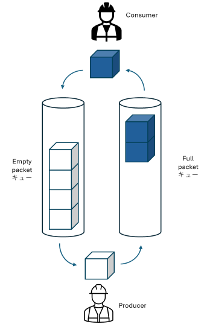
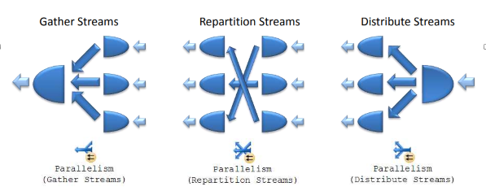
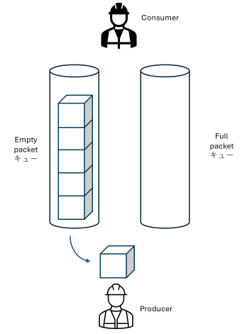

**適用対象**
SQL Managed Instance
SQL Database
SQL Server 2022 以降

<!-- more -->

 
 

## 並列クエリとは

ひとつのクエリは通常ひとつのスレッドによって実行されます。しかしながら、アクセス対象データ量が多いことが想定される場合、一つのクエリが複数のスレッドを使って実行されることがあります。このようなクエリは並列クエリ (parallel query) と呼ばれます。

並列クエリの実行プランには Parallelism 物理オペレーター (以降 Prallelism) が必ず含まれます。Parallelism は Exchange とも呼ばれます。

 

## スレッド間でのデータの受け渡し

Parallelism 上では、Parallelism の右側 (実行プラン内の下位) を実行する子スレッドから左側 (実行プラン内の上位) を実行する親スレッドへデータが渡されます。子スレッドはデータを生成するという意味で Producer (生産者) と呼ばれ、親スレッドはデータを消費するという意味で Consumer (消費者) と呼ばれます。

例えば、以下の実行プランが並列度 4 (degree of parallelism/DOP = 4) で実行された場合には、クエリのメインスレッドが Parallelism に達すると、並列度数に従って 4 つの子スレッドを起動します。従って、このクエリは、メインスレッド 1 つと子スレッド 4 つの合計 5 つのスレッドによって実行されることになります。
Producer は Parallelism の右側にある Sort - Filter - Table Scan を実行して Prallelism 上で Consumer に行を渡し、Consumer は 4 つの Producer から受け取った行をソート順を維持したままマージしてクエリの最終結果を生成し、クライアントへ送ります。

Producer から Consumer へのデータの受け渡しは Exchange Packet を用いて行われます。Producer は空の Exchange Packet にデータを入れて Consumer に渡し、Consumer はデータで満たされた Exchange Packet を受け取って Exchange Packet からデータを取り出して処理します。

 

## Parallelism 物理オペレーターの論理操作

Parallelism には 3 つの論理操作があります。

| 論理操作              | データ受け渡し                          |
| -------------------- |----------------------------------------|
| Gather Streams       | 複数の Producer からひとつの Consumer へ |
| Repartition Streams  | 複数の Producer から複数の Consumer へ   |
| Distribution Streams | ひとつの Producer から複数の Consumer へ |

 

## CXCONSUMER 待ちとはどのような状態を示しているのか？

Consumer がデータで満たされた Exchange Packet を待っている状態です。

 

## CXPACKET 待ちとはどのような状態を示しているのか？

Producer が空の Exchange Packet を待っている状態です。

### CXCONSUMER 待ちが発生した場合の確認ポイント

CXCONSUMER 待ちは Consumer がデータの入った Exchange Packet を待っている状態であるため、直接的には Producer が Consumer を待たせていることになります。そのため、まずは Producer の状態を確認します。

実行中のクエリの各スレッドの待ちは [sys.dm_os_waiting_tasks (Transact-SQL)](https://learn.microsoft.com/ja-jp/sql/relational-databases/system-dynamic-management-views/sys-dm-os-waiting-tasks-transact-sql?view=sql-server-ver16) で確認することができます。

#### - よくあるパターン 1 : Producer が待ち状態ではない場合

Producer がテーブルやインデックスの広範囲をスキャンしなければならない状況で、スキャン範囲内のほとんどの行が WHERE 条件を満たしていないなど対象外となるような場合には、Producer が Consumer へ渡すべき行を見つけるまでに時間がかかることになるため、CXCONSUMER 待ちが発生することは想定された状況です。この状況を改善するためには、Producer のスキャン範囲を狭めるために適切なインデックスを作成することが有効です。

インデックス等によって Producer のスキャン範囲が既に最小範囲に限定されている状況であれば、CXCONSUMER 待ちは避けることができないものと考えられます。

#### - よくあるパターン 2 : CXCONSUMER 待ちが短時間

CXCONSUMER 待ちの発生が断続的かつそれぞれの待ち時間もミリ秒単位の短いものであれば、おそらくクエリは効率的に実行されていて、特に対処の必要はないものと考えられます。

#### - よくあるパターン 3 : Producer がロック獲得待ち

Producer が要求するロックが他のトランザクションが保持しているロックと競合した場合、Producer はロック獲得待ち (wait_type = LCK_M_*) となります。この状況では、Producer は Exchange Packet に新たな行を入れることはできませんので、Consumer は CXCONSUMER 待ちになります。Producer がロック獲得待ちになるのは、他のトランザクションとロックが競合しているからであり、ロックが競合する確率は、獲得するロック数が多くなるほど高くなります。従って、Producer が獲得する必要のあるロックが最小数になるようにチューニングすることが効果的です。そのためにはスキャン範囲が必要最小限になるようなインデックスが必要です。一方で、競合相手となっているトランザクションの観点においては、スキャン範囲を最小限にするとともに、ロック保持期間、つまり、トランザクションがコミットされるまでの時間を最短にするためのチューニングが必要です。

ここで注意が必要な点として、ロックが獲得されるのはクエリの最終結果に含まれる行やキーだけではないという点があげられます。詳しくは、[こちら](https://learn.microsoft.com/en-us/archive/blogs/jpsql/277)を参照してください。

#### - よくあるパターン 4 : Producer が PAGEIOLATCH_SH などのファイル IO 完了待ち

Producer が PAGEIOLATCH_SH や PAGEIOLATCH_EX 待ち (ファイル IO 待ち) になっている場合、クエリによってアクセスされるデータの多くがキャッシュされていない状態であると考えられます。顕著な PAGEIOLATCH 待ちが見られる場合、改善のためには、ストレージが処理可能な IO 数を増やすか、クエリが発行する IO 数を減らすかのどちらかの対応が考えられます。

処理可能な IO 数を増やすというアプローチで対応しようとすると、SQL Managed Instance (以降 SQL MI) General Purpose であればファイルサイズを大きくして[IOPS の上限](https://learn.microsoft.com/ja-jp/azure/azure-sql/managed-instance/resource-limits?view=azuresql#file-io-characteristics-in-general-purpose-tier)を引き上げるか、Business Critical に移行するという方法が考えられます。
SQL MI Next-gen General Purpose や Business Critical であれば仮想コア数を追加して[IOPS の上限](https://learn.microsoft.com/ja-jp/azure/azure-sql/managed-instance/resource-limits?view=azuresql#iops)を引き上げることが有効な場合があります。

ストレージが処理可能な IO 数を増やすのではなく、クエリが発行する IO を減らすというアプローチで対応する場合は、クエリがアクセスするデータ量を減らすために、クエリの実行プランを確認し、インデックスの追加や変更、テーブル構成の見直し、クエリ内の WHERE や JOIN ON などの条件の見直しなどを行います。

個々のクエリではなくインスタンス全体としてバッファプール内のデータの入れ替えが激しいためにファイル IO が多くなっている状況 (Page life expectancy が低い状況) であれば、キャッシュできるデータ量を増やすためにメモリサイズを大きくするといった対応が考えられます。SQL MI であれば[メモリサイズはコア数に比例](https://learn.microsoft.com/ja-jp/azure/azure-sql/managed-instance/resource-limits?view=azuresql#max-memory)して大きくなります。

#### - その他の待ち

上記以外にも、Producer はいろいろな待ちになる可能性がありますので、どのような待ちであるのかを確認し、確認できた待ちに対応した対処が必要になります。

 

## CXPACKET 待ちが発生した場合の確認ポイント

CXPACKET 待ちは、Producer が空の Exchange Packet を待っている状態であるため、直接的には Consumer が Producer を待たせていることになります。そのため、まずは Consumer の状態を確認します。
実行中のクエリの各スレッドの待ちは [sys.dm_os_waiting_tasks (Transact-SQL)](https://learn.microsoft.com/ja-jp/sql/relational-databases/system-dynamic-management-views/sys-dm-os-waiting-tasks-transact-sql?view=sql-server-ver16) で確認することができます。

#### - よくあるパターン 1 : Consumer が待ち状態ではない場合や CXPACKET 待ちが短時間である場合

Consumer が待ち状態ではない (sys.dm_os_waiting_tasks の結果に含まれない) 場合や CXPACKET 待ち時間がミリ秒単位の短い時間である場合、Producer のデータ生成に対して Consumer のデータ消費が追い付いていない状況ということになりますが、Parallelism の論理操作が Gather Streams であれば、ひとつの Consumer に対して複数の Producer という構成になるため、Producer の生成するデータ量が多い場合にはこの状況になりえます。この場合は、クエリは良好に実行されており、特に対処の必要はないものと考えられます。

なお、このような場合であっても、MAXDOP 値を調整することでさらにクエリ全体の実行時間を短くすることができる場合もありますので、業務要件上さらなるクエリの短時間化が要求される場合は、実際に MAXDOP 値を変えながらクエリを実行して、そのクエリにとって最適な MAXDOP 値を見つけてみてください。

#### - よくあるパターン 2 : Consumer が ASYNC_NETWORKIO 待ち

実行プラン内の最初の Parallelim の左側部分を実行する Consumer (この場合はメインスレッド) が ASYNC_NETWORK_IO 待ちである場合、CXPACKET 待ちの原因は、クエリを実行しているアプリケーションがクエリの結果を取得していないことです。

クエリ結果が 1 つの TDS パケットに収まらない場合は複数のパケットに分割されて順次クライアントアプリケーションへ送信されることになりますが、クエリのメインスレッド (Consumer) は、クライアントアプリケーションが次の結果を要求するまではクライアントアプリケーションに結果を送信することができません。クライアントアプリケーションが次の結果を要求するまでの間、Consumer は ASYNC_NETWORK_IO 待ちとなります。クエリ結果がある程度大きい場合には、ネットワーク上を流れるパケット数も多くなるため、ASYNC_NETWORK_IO 待ちが観察されるのは想定される状況ですが、クエリ全体の実行時間に占める ASYNC_NETWORK_IO 待ちの割合が極端に多い場合は、クライアントアプリケーションの処理ロジックも含めて、なぜクライアントアプリケーションがタイムリーにクエリ結果を取得できていないのかを調査する必要があります。例えば、クエリの結果を取得している最中にユーザー入力を求めたり、ユーザーがスクロールダウンしてデータを表示しない限り次の結果を取得しないアプリケーションであれば、それは ASYNC_NETWORK_IO 待ち原因になるため、アプリケーションのデザインの見直しを検討する必要があるかもしれません。

> [!NOTE] クライアントが次の結果を要求せず、ASYNC_NETWORK_IO 待ちが継続している場合であっても ASYNC_NETWORK_IO 待ちの時間 (sys.dm_os_waiting_tasks や sys.dm_exec_requests の wait_time 列の値) は 2000 ミリ秒に達すると一度リセットされて 0 に戻ります。その後、再び増加します。

#### - よくあるパターン 3 : Consumer が CXCONSUMER 待ち

Procuder 1 ～ 3 は Consumer を待っていて、その Consumer が Producer 4 を待っているといった状況です。この場合は、待ち行列の先頭にある Producer 4 の状態を確認する必要があります。

例えば、この投稿の冒頭の実行プランの場合、Consumer は Parrallelism 上でソート順を維持した状態で Producer から受け取ったデータをマージする必要があるため、いわゆるマージソートと同じ処理を実行する必要があり、Producer 1 ～ 4 すべてからデータを受け取る必要があります。従って、Producer の一つがロック待ちになると、Consumer は CXCONSUMER でその Producer 待ち、その Producer 以外の Producer は CXPACKET で Consumer 待ちという状況になります。この状況は、Producer のロック待ちが根本原因であるため、CXPACKET 待ちに対処するためには、ロック待ちを最小化する (短時間化する) 必要があります。

 
 

神谷 雅紀

Azure SQL Managed Instance support, Microsoft

 
 
 
