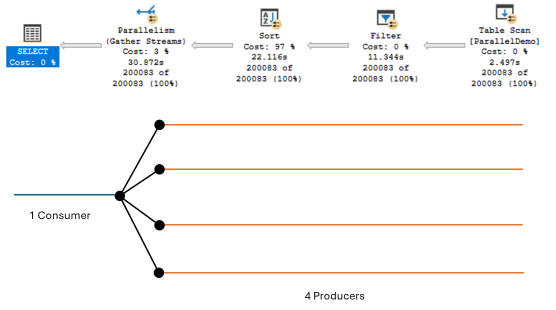
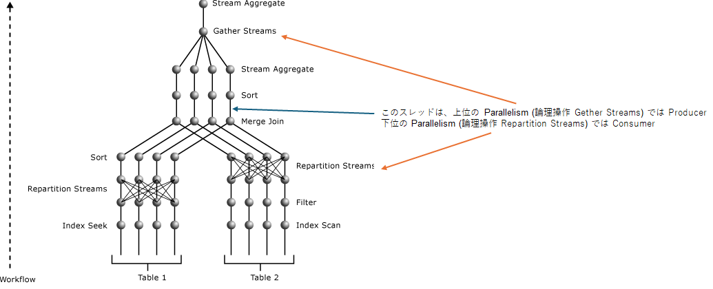
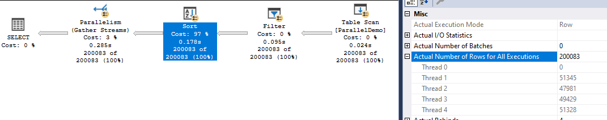

 

**適用対象**
SQL Managed Instance
SQL Database
SQL Server 2022 以降

<!-- more -->

 
 

## 初めに

この投稿は、実行プランを見てクエリがどのように実行されているのかを理解できることを前提としています。
実行プランの見方が分からない場合は、この投稿の前に以下の文書を読んで下さい。

[実行プランを読む - 基本編 (その 1)](https://learn.microsoft.com/en-us/archive/blogs/jpsql/1)
[実行プランを読む - 基本編 (その 2)](https://learn.microsoft.com/en-us/archive/blogs/jpsql/2)

以下の文書については、この投稿を読む上では必しも必要ではありませんが、上の 2 つの文書の関連となりますので参考としてここで紹介します。

[実行プランを読む - 基本編 (その 3)](https://learn.microsoft.com/en-us/archive/blogs/jpsql/3)
[実行プランを読む - 基本編 (その 4)](https://learn.microsoft.com/en-us/archive/blogs/jpsql/4)

 

## 並列クエリ

ひとつのクエリは通常ひとつのスレッドによって実行されますが、アクセス対象データ量が多いことが想定される場合、一つのクエリが複数のスレッドによって実行されることがあります。このようなクエリは並列クエリ (parallel query) と呼ばれます。

並列クエリの実行プランには Parallelism 物理オペレーター (以降 Parallelism) が必ず含まれます。

 

## スレッド間でのデータの受け渡し

Parallelism では、Parallelism の右側 (実行プラン内の下位) を実行する子スレッドから左側 (実行プラン内の上位) を実行する親スレッドへデータが渡されます。スレッド間でデータ交換を行うという観点から、Parallelism は Exchange とも呼ばれます。
子スレッドはデータを生成するという意味で Producer (生産者) と呼ばれ、親スレッドはデータを消費するという意味で Consumer (消費者) と呼ばれます。

例えば、以下の実行プランが並列度 4 (degree of parallelism または DOP = 4) で実行された場合には、クエリの実行が開始され、メインスレッドが Parallelism に到達すると、並列度数に従って 4 つの子スレッドを起動します、従って、このクエリは、メインスレッド 1 つと子スレッド 4 つの合計 5 つのスレッドによって実行されることになります。
Producer は Parallelism の右側にある Sort - Filter - Table Scan を実行して Parallelism 上で Consumer に行を渡し、Consumer は 4 つの Producer から受け取った行をソート順を維持したままマージしてクエリの最終結果を生成し、クライアントに送ります。

 

 

Producer, Consumer は Parallelism 上での役割を表す表現であるため、実行プラン内に複数の Parallelism がある場合には、上位の Parallelism における Procuder は、下位の Parallelism では Consumer になります。

 

 

## CXSYNC_PORT 待ちとはどのような状態を示しているのか？

並列クエリ固有の待ち状態である CXSYNC_PORT 待ちは、並列クエリを実行する各スレッドが、「自分自身はデータの受け渡しを開始できる状態になったので、他のすべてのスレッドもデータの受け渡しを開始できる状態になるのを待っている状態」です。もう少し実装寄りの表現を用いるなら、この Parallelism 上でデータ交換を行うすべてのスレッドがオペレーターの Open 呼び出しを完了して Exchange Port を Open するのを待っている状態です。

すべてのスレッドがデータの受け渡しを開始できる状態になれば、実際のスレッド間データ受け渡しを含む処理を開始することが可能になりますので、その時点でこの待ちは解消します。

 

## CXSYNC_PORT 待ちが発生した時に何か対処する必要があるのか？

「CXSYNC_PORT 待ちは並列クエリ固有の待ちなのでこの待ちの原因は並列クエリであることだ。だから並列クエリをやめるために MAXDOP を 1 にする必要がある」や「MAXDOP を下げる必要がある」と短絡的に考える人がいますが、CXSYNC_PORT 待ちの発生が観察された時に対処の必要があるかどうかは、そのクエリの実行プランや各スレッドの実行状況に依存します。

CXSYNC_PORT 待ちに対して何も対処を行わなかったとしても、そのクエリを単一スレッドで実行するよりも並列クエリとして実行した方が短時間でクエリを完了できる場合も多くあります。実行プランによってはそもそも対処の必要がない (CXSYNC_PORT 待ちをなくす必要がない) 場合もあります。また、何らかの対処を行った方がいい場合であっても、CXSYNC_PORT 待ちの原因が CXSYNC_PORT 待ちそのものにあることは稀で、ほとんどの場合は他にあります。

 

## CXSYNC_PORT 待ちが発生した時の確認ポイント

 

#### - 確認ポイント 1: Stop and Go オペレータを含む実行プランであるか

例えば、以下の実行プランは Stop and Go オペレーターのひとつである Sort が子スレッドによって実行されています。Sort は指定されている順番に行を並べ、親オペレーターに対してソート順を維持したまま行を渡す必要があります。そのため、Sort がデータの受け渡しを開始できるようになるのは、すべての対象行を読み込んで指定されている順番に並び替えた後です。言い換えれば、Sort の Open から復帰した後です。
前述の通り、CXSYNC_PORT 待ちはすべてのスレッドがデータの受け渡しが可能になるのを待っている状態 (オペレーターの Open が完了して Port の Open をした状態) です。この例でいえば、各 Producer (Thread 1 ～ 4) は 50000 前後の行を読み取って並べ替えていますが、この 4 つの Producer スレッドすべてがこの処理を完了させるまでは Consumer (Thread 0) は CXSYNC_PORT 待ちです。つまり、このクエリは Consumer が CXSYNC_PORT 待ちの間にクエリ処理のほとんどを完了しており、CXSYNC_PORT 待ちが解消した後に行う必要のある処理は、Consumer が Producer 達からソート済みの結果を受け取って、ソート順を崩さないようにマージしてクライアントへ返送するだけです。

このようなクエリについては、Consumer はクエリ全体の実行時間の多くを CXSYNC_PORT 待ちの状態で過ごすことが想定され、必ずしも CXSYNC_PORT 待ちを解消するために何かをする必要はない可能性があります。

> [!NOTE]
> [sys.dm_os_wait_stats (Transact-SQL)](https://learn.microsoft.com/ja-jp/sql/relational-databases/system-dynamic-management-views/sys-dm-os-wait-stats-transact-sql?view=sql-server-ver16) の CXSYNC_PORT の説明に「クエリ プランに長い並べ替え操作がある場合、Exchange 反復子ポートを同期する前に並べ替えを完了する必要があるため、 CXSYNC_PORT 待機が高くなる可能性があります。」(if a query plan has a long sort operation, CXSYNC_PORT waits might be higher because the sort must complete before the Exchange Iterator port can be synchronized.) と書かれているのはこの状況を指しています。

 

#### - 確認ポイント 2: CXSYNC_PORT 待ちの原因となっているスレッドが何かを待っていないか

CXSYNC_PORT 待ちになるのは Consumer だけとは限らず、Procuder が CXSYNC_PORT 待ちになる場合もあります。例えば、前述の例で、ひとつの Producer の処理が他の Producerよりも時間がかかる状況になれば、Consumer と先に処理を完了した Producer は CXSYNC_PORT 待ちになります。この状況の場合、対処すべきポイントとなる可能性があるのは CXSYNC_PORT 待ちのスレッドではなく、処理に時間のかかっている CXSYNC_PORT 待ちではない Producer です。

このような場合、処理が完了していない Producer が何らかの待ち状態になっていないかどうかを確認する必要があります。
待ち状態になっているのであれば、その待ちを解消することでその他のスレッドの CXSYNC_PORT 待ちも解消することができます。

実行中のクエリの各スレッドの待ちは [sys.dm_os_waiting_tasks (Transact-SQL)](https://learn.microsoft.com/ja-jp/sql/relational-databases/system-dynamic-management-views/sys-dm-os-waiting-tasks-transact-sql?view=sql-server-ver16) で確認することができます。

例えば、その Producer がロック獲得待ちになっているのであれば、そのロック待ち時間が最小になるようにすることで CXSYNC_PORT 待ちの時間も短くすることができます。ロック獲得待ちが発生する要因は、他のトランザクションと競合するロックを獲得しようとしているからであり、ロックが競合する確率は、獲得するロック数が多くなるほど高くなります。従って、CXSYNC_PORT 待ちとなっているクエリの観点においては、Producer が獲得する必要のあるロックが最小数になるようにチューニングすることが効果的です。そのためにはクエリのデータアクセス範囲が必要最小限になるようなインデックスが必要です。一方で、競合相手となっているトランザクションの観点においては、データアクセス範囲を最小限にするとともに、ロック保持期間、つまり、ロックを獲得してからトランザクションをコミットするまでの時間を最短にするためのチューニングが必要です。

 

#### - 上記確認ポイントに該当しない場合

おそらくそのクエリは最適に実行されていて、対処の必要はありません。

もし、さらにパフォーマンスの改善余地があるのかどうかを確認したい場合は、クエリに対して適切なインデックスがあるか、統計情報が最新か、クエリ内で比較している列やパラメーターのデータ型が一致しているか、比較列を加工していないか、といった基本的な点を再確認し、デフラグのために対象テーブルやインデックスの再構築 (ALTER INDEX REBUILD, ALTER TABLE REBUILD) を行った後、改めてクエリを実行してパフォーマンスが改善するかどうか確認してみてください。

> [!NOTE]
> データ型を一致されることや比較列を加工しないようにすることの重要性については以下で説明しています。
>  
> [絶対にやらなければいけないこと - データ型を一致させる](https://learn.microsoft.com/en-us/archive/blogs/jpsql/dosdonts-2)
> [やらない方がいいこと - クエリの 条件句 (WHERE や JOIN ON 等) で参照されている列の加工](https://learn.microsoft.com/en-us/archive/blogs/jpsql/dosdonts-4-where-join-on-123)

 
 

神谷 雅紀

Azure SQL Managed Instance support, Microsoft

 
 
 
