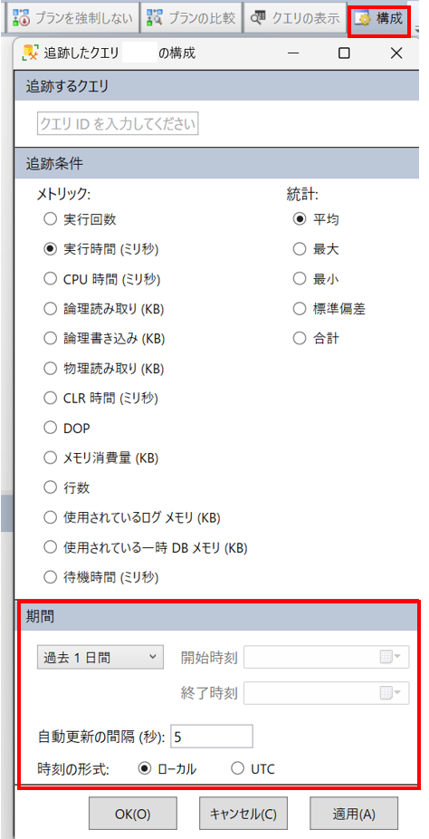
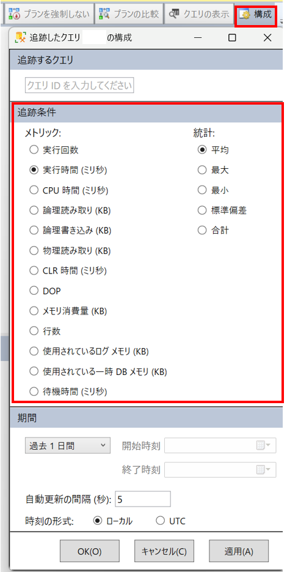
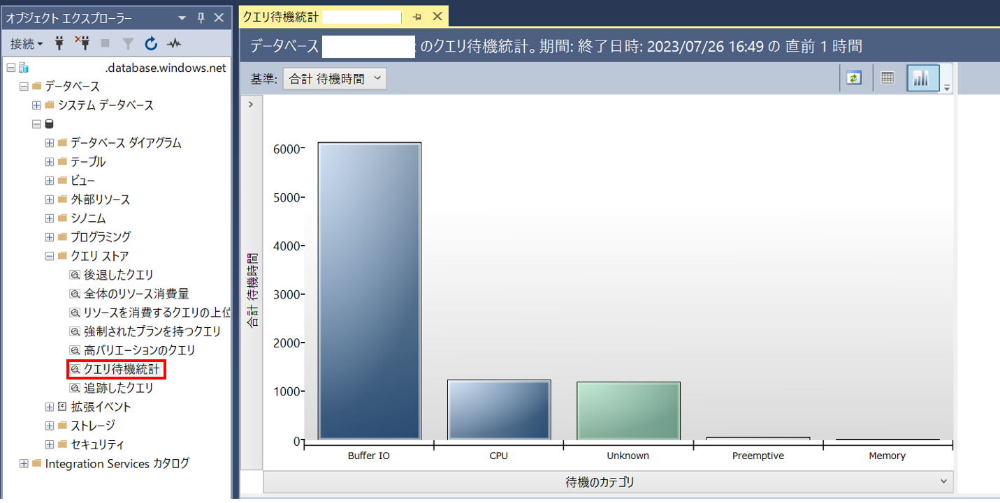

こんにちは。SQL Cloud サポート チームの川野辺です。

今回の投稿では、Azure SQL Database (SQL DB)、SQL Managed Instance (SQL MI) において、特定クエリのパフォーマンスが悪化した際の調査方法を紹介します。

<!-- more -->

## なぜクエリのパフォーマンスが悪化するのか
---

SQL DB、SQL MI において、パフォーマンスが悪化し、実行時間が増加する場合には、データベースの負荷が高い、処理で待機が発生している、クエリの対象となるデータが多い、メモリへのアクセスと比較して低速なファイルへのアクセスが発生している、クエリの実行手順を決定する実行プランが変化したなどが考えられます。
これらの問題の切り分けには、既定で有効化されているクエリストアの情報を確認することが有効です。なお、クエリストアに関して、直近で新規に作成されたデータベースでは既定で有効化されておりますが、全てのクエリの実行情報を取得する設定ではなく、期待する結果が取得されていない可能性がありますのでご注意ください。詳細は以下の公開情報にあります。

[クエリ ストアを管理するためのベスト プラクティス](https://learn.microsoft.com/ja-jp/sql/relational-databases/performance/manage-the-query-store?view=sql-server-ver16&tabs=ssms)

## パフォーマンスが悪化したクエリの調査手順
---

1. 対象クエリの Query ID を確認します。

対象クエリの実行情報をクエリストアから確認するためには、Query ID を明らかにする必要がありますので、SQL Server Management Studio (SSMS) などから対象のデータベースに対して以下のクエリを実行してください。その際に、<クエリ文> に対象のクエリテキストを指定します。

```CMD
SELECT q.query_id, qt.query_sql_text
FROM sys.query_store_query_text AS qt
JOIN sys.query_store_query AS q
ON qt.query_text_id = q.query_text_id
where qt.query_sql_text like '%<クエリ文>%'
```

実行例：調査対象のクエリが SELECT getdate() で始まる場合


2. SSMS の [追跡したクエリ] の [追跡中のクエリ] にて、手順 1 で取得した対象クエリの Query ID を入力します。


3. 右上の [構成] にて期間を変更可能ですので、パフォーマンスの差異が生じた期間を含むように設定します。

既定では、[メトリック] が [実行時間] になっているため、実行時間が長くなり、パフォーマンスが悪化するような状況をこちらから確認可能です。



4. [メトリック] を変更し、実行時間の差異の原因を特定します。

[待機時間] を選択すると、クエリにおける待機時間の差異を調査することができ、待機によって実行時間に差異が生じていたかを判断可能です。
その他には、[CPU 時間] や [物理読み取り] などからリソースの利用状況に関して確認可能です。[物理読み取り] に関しては、低速なファイルアクセスである物理読み取りの確認が可能ですので、こちらが増加している場合は、クエリの対象データが増加しているか、メモリ上のキャッシュにデータが存在していなかった可能性があります。



5. 実行プランを確認します。

実行プランはクエリの実行順序やアルゴリズムを定義するものであり、こちらが異なることでパフォーマンスに差異が生じる可能性がありますので、実行プランの変化も合わせて確認します。実行時間が短い場合と長い場合で、実行プランが異なる際には、以下の公開情報に詳細があります。

[実行プランの確認](https://learn.microsoft.com/ja-jp/sql/relational-databases/performance/query-store-usage-scenarios?view=sql-server-ver15#identify-and-tune-top-resource-consuming-queries)


6. 手順 4. で [待機時間] が高騰している場合、[クエリ待機統計]  より該当の時間の待機状態を確認可能です。

待機カテゴリを選択すると原因となっていたクエリ ID を確認することが確認でき、対象のクエリでどのような待機が発生していたかを明らかにできる可能性があります。待機が発生していた場合、各待機の詳細に関しては、以下の公開情報に詳細な説明があります。

[待機クエリを見つける](https://docs.microsoft.com/ja-jp/sql/relational-databases/performance/monitoring-performance-by-using-the-query-store?view=sql-server-ver15#Waiting)




## パフォーマンスの改善に実施できること
---
上記の手順でパフォーマンスが悪化した原因が確認できましたら、以下の公開情報の対策でパフォーマンスを改善できる可能性があります。
なお、SQL DB や SQL MI は PaaS 製品であることから、柔軟にコンピューティングリソースの増減が可能です。調査コストなどを踏まえるとリソース変更が経済的な解決策になる可能性もありますので、合わせて検討します。

[どうする？ SQL Server のクエリ パフォーマンスが低下した！](https://learn.microsoft.com/ja-jp/archive/blogs/jpsql/sql-server-5)

[Azure SQL Database パフォーマンス チューニング](https://learn.microsoft.com/ja-jp/archive/blogs/jpsql/microsoft-azure-sql-database-%E3%83%91%E3%83%95%E3%82%A9%E3%83%BC%E3%83%9E%E3%83%B3%E3%82%B9-%E3%83%81%E3%83%A5%E3%83%BC%E3%83%8B%E3%83%B3%E3%82%B0-%E7%AC%AC%EF%BC%91%E5%9B%9E)
