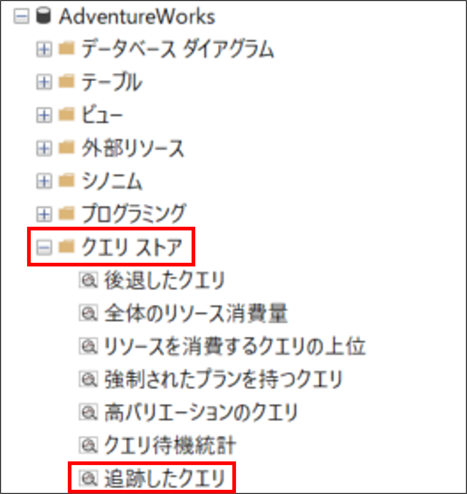
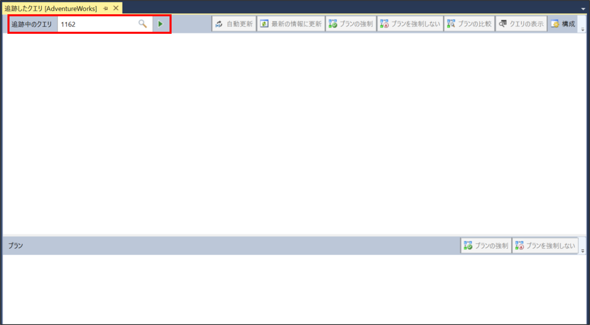
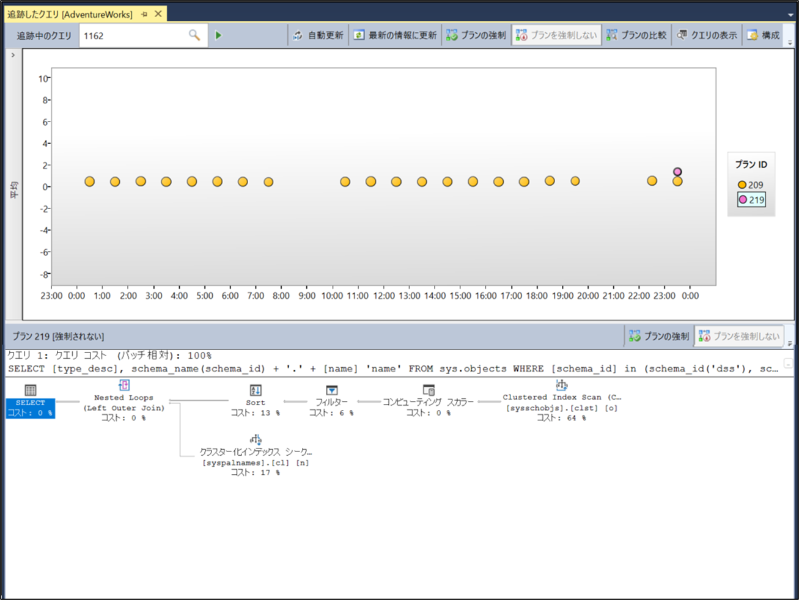
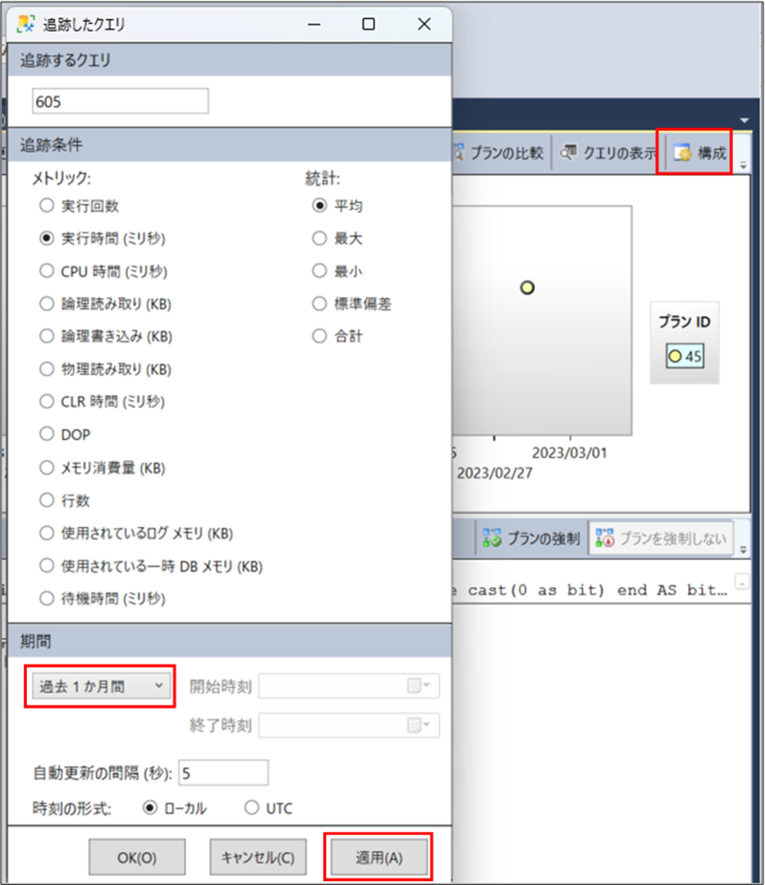
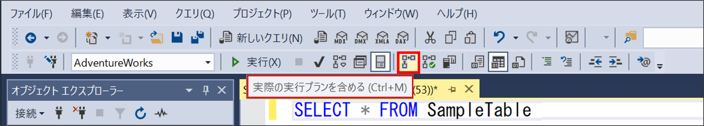
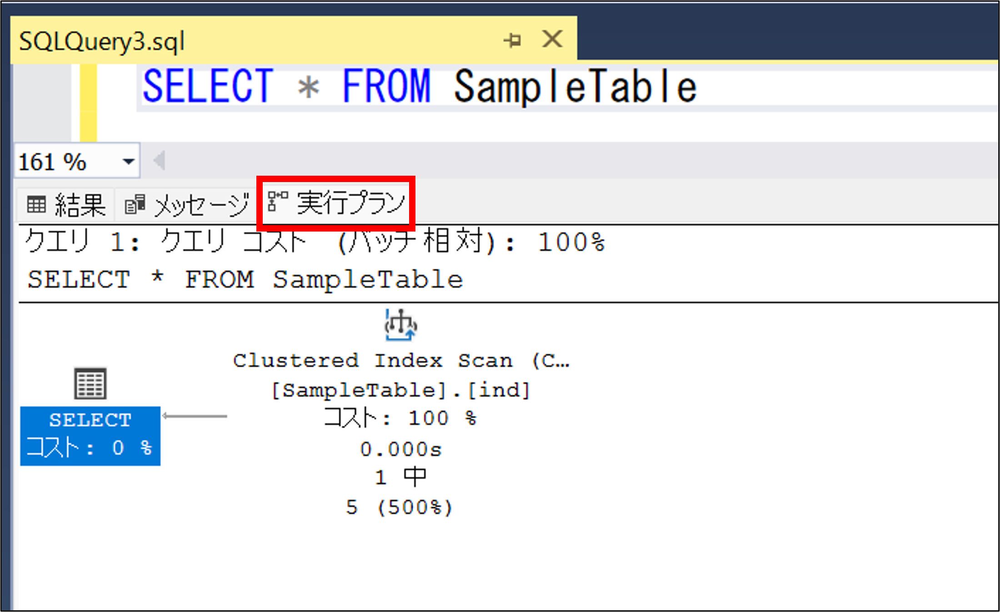

こんにちは。SQL Cloud サポート チームの宮崎です。

今回の投稿では、Azure SQL Database (SQL DB)、SQL Managed Instance (SQL MI) において、パフォーマンスのトラブルシューティング時に使える実行プランの確認方法をご紹介します。

<!-- more -->

## 実行プランとパフォーマンスについて
---

[過去のブログ記事](https://jp-azuresql.github.io/blog/Performance/performance-tsg/) にも記載の通り、SQL DB、SQL MI において、パフォーマンスが悪化し実行時間が増加した、CPU や Data IO といったリソース使用率が増減したという場合には、クエリの実行手順を決定する「実行プラン（実行計画）」の変化が原因であることがあります。

> [!NOTE]
> 実行プランはクエリの実行順序やアルゴリズムを定義するものであり、実行プランが異なることでパフォーマンスに差異が生じる可能性があります。

実行プランには 2 種類あり、プラン生成時に実際にクエリが実行されず、クエリ実行時に使用されたリソース状況やランタイム情報が含まれていない「推定の実行プラン」と、実際にクエリの実行を伴い、クエリ実行により使用されたリソース状況やランタイム情報を含む「実際の実行プラン」があります。

SQL DB、SQL MI において、クエリの実行情報を記録するクエリストア（SQL DB /SQL MI 共に既定で有効）から「推定の実行プラン」の履歴を確認できます。クエリストア内の推定の実行プランにより、過去に異なるプランが使用されたか、またどの様なプランが使用されたのかを確認することができます。

一方、実行プランが実際のクエリ実行時にどの処理にどれほどリソースを使用したかといった詳細情報を見る場合は「実際の実行プラン」を確認する必要があります。

> [!WARNING]
> SQL DB/SQL MI にて、既定では「実際の実行プラン」を取得していません。
> 実際の実行プランを取得するためには、事前に拡張イベント（query_post_execution_showplan）を有効化するか、事象の再現性がある場合に限り SET オプション（SET SHOWPLAN_XML）を有効にしてからクエリを実行します。

[実行プランの概要](https://learn.microsoft.com/ja-jp/sql/relational-databases/performance/execution-plans?view=sql-server-ver16)

[プラン表示の論理操作と物理操作のリファレンス](https://learn.microsoft.com/ja-jp/sql/relational-databases/showplan-logical-and-physical-operators-reference?view=sql-server-ver15)

## クエリストアから推定の実行プランの確認方法
---
次の手順で SQL Server Management Studio（SSMS）の GUI を用いてクエリストアから推定の実行プランの履歴を確認できます。

### 1. SSMS から対象のデータベースのクエリストアを選択します

SSMSより、対象データベースの「オブジェクト エクスプローラー」から「クエリストア」を展開し、「Tracked Queries（追跡したクエリ）」を選択（ダブルクリック）します。



### 2. 対象クエリのクエリ ID を入力しクエリの追跡を実行します

SSMS の [追跡したクエリ] 画面左上部の [追跡中のクエリ] にて、実行プランを確認したいクエリのクエリ ID を入力し実行します。



※クエリ ID がわからない場合は、対象のデータベースに接続した上で以下のようなクエリを実行することでクエリテキストを含め確認できます。

```CMD
SELECT TOP 100 qsq.query_id, qsq.query_hash,qsqt.query_sql_text
FROM sys.query_store_query as qsq
JOIN sys.query_store_query_text as qsqt
on qsq.query_text_id = qsqt.query_text_id;
	
--クエリテキストの一部を WHERE 句に指定してフィルターすることも可能です
SELECT TOP 100 qsq.query_id, qsq.query_hash,qsqt.query_sql_text
FROM sys.query_store_query as qsq
JOIN sys.query_store_query_text as qsqt
on qsq.query_text_id = qsqt.query_text_id
WHERE qsqt.query_sql_text LIKE '%<クエリテキストの一部>%';
```

### 3. 実行プランを確認します

クエリの実行がクエリストアに記録されていた場合は、画面上部に実行プランのプラン ID が表示され、各実行プランを選択すると該当する実行プランの内容が画面下部に表示されます。

異なる実行プランが使用されていた場合は、複数の実行プランが表示されます（画面右上の プラン ID が複数表示され、複数の色形をしたマークがプロットされます）。
既定では、画面上部のグラフの縦軸は平均の実行時間（ミリ秒）となっています。



該当クエリの実行プランが直近のものしか表示されない場合は、期間が短く設定されている場合があるため、画面右上の「構成」から期間を長めに変更し「適用」を選択します。



> [!WARNING]
> クエリストアの既定値では、過去に実行されたすべてのクエリを記録しているわけではないため、該当クエリの実行プランがクエリストアに保存されていない場合もあります。
> また、保存されていたとしてもクエリストアの保持期間や最大サイズの設定によっては既に削除されてしまっている場合もあります。
> クエリストアの既定値や設定変更は[こちらのドキュメント](https://learn.microsoft.com/ja-jp/sql/relational-databases/performance/manage-the-query-store?view=sql-server-ver16&tabs=ssms#QueryStoreOptions)をご参照ください。

[推定実行プランの表示](https://learn.microsoft.com/ja-jp/sql/relational-databases/performance/display-the-estimated-execution-plan?view=sql-server-ver16)

## 実際の実行プランの確認方法
---
次の手順で SSMS を用いて実際の実行プランを確認できます。

### 1. SSMS のクエリエディタを開き、実際の実行プランの採取設定を有効化しクエリを実行します

#### SET コマンドを使う場合

SSMS のクエリエディターにて SET コマンドを実行した後に対象のクエリを実行します。

```CMD
-- 実際の実行プランの採取設定の有効化
SET STATISTICS XML ON;

-- 対象のクエリを実行（実際のクエリに置き換えください）
SELECT * FROM SampleTable
```

[SET STATISTICS XML (Transact-SQL)](https://learn.microsoft.com/ja-jp/sql/t-sql/statements/set-statistics-xml-transact-sql?view=sql-server-ver16)

#### SSMS の GUI を使う場合

SSMS のツールバーから「実際の実行プランを含める」を選択し、対象のクエリを実行します。



### 2. クエリ実行結果の「実行プラン」タブで実際の実行プランを表示します

SET オプションや GUI 操作にて、実際の実行プランの採取を有効化した場合、そのセッションにて実行されたクエリの結果の「実行プラン」タブに実際の実行プランが表示されます。
実行プランを右クリックして「実行プランに名前を付けて保存」を選択することで、実行プランを保存することもできます。

> [!NOTE]
> SET オプションや SSMS の GUI による実際の実行プランの採取設定は、そのセッションでのみ有効となり、別のセッションには影響がありません（別セッションでは実際の実行プランが取得されません）。




[実際の実行プランの表示](https://learn.microsoft.com/ja-jp/sql/relational-databases/performance/display-an-actual-execution-plan?view=sql-server-ver16)
