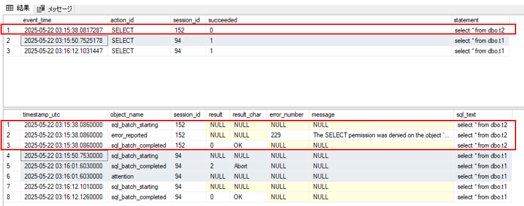

SQL 監査のサーバー監査仕様、データベース監査仕様には succeeded という名前の列があります。succeeded 列の値が 1 (成功) であったとしても、必ずしもその操作が成功したとは限りません。

<!-- more -->

 
 

**適用対象**
SQL Managed Instance
SQL Database
SQL Server

 
 

## succeeded 列の値の意味

succeeded 列は、[sys.fn_get_audit_file (Transact-SQL)](https://learn.microsoft.com/ja-jp/sql/relational-databases/system-functions/sys-fn-get-audit-file-transact-sql?view=sql-server-ver16&tabs=sqlserver) では以下のように説明されています。

| 列名      | 説明                              | 
|-----------|----------------------------------|
| succeeded | イベントをトリガーしたアクションが成功したかどうかを示します。 NULL 値は許可されません。 ログイン イベント以外のすべてのイベントで、操作ではなく、権限チェックが成功したか失敗したかのみを報告します。  1 = 成功 0 = 失敗  Indicates whether the action that triggered the event succeeded. Not nullable. For all events other than login events, this only reports whether the permission check succeeded or failed, not the operation.  1 = success 0 = fail|

 

## 実際の結果を見てみましょう

以下は、上段が SQL 監査、下段が拡張イベントです。3 回 select を実行し、初回は権限不足のために失敗、2 回目はクエリタイムアウトで失敗、3 回目は成功です。
 

### 権限不足による失敗 (succeeded = 0)
1 回目の実行は、SELECT 権限がないために select ステートメントは失敗しています。この場合、下段の拡張イベントでは error_reported でエラー 229 (The SELECT permission was denied on the object ...) が記録され、上段の SQL 監査のアクション SELECT の succeeded は 0 (失敗) になっています。

 

### クエリタイムアウトによる中断 (succeeded = 1)

2 回目の実行は、クエリタイムアウトにより実行が中断されています。この場合、拡張イベントでは sql_batch_completed で中断 (abort) が記録され、クライアントから処理中断を受け取ったことを示す attention も記録されています。
一方、SQL 監査の succeeded は 1 (成功) になっています。これは、select ステートメントの実行はクエリタイムアウトにより中断されているものの SELECT 権限のチェックは成功しているため、冒頭の文書の説明の通り、権限チェックの結果として 1 (成功) が示されています。

 

### 権限チェックとクエリ実行とも成功 (succeeded = 1)

3 回目の実行は、select は成功していますので、拡張イベントも SQL 監査も成功を記録しています。

 

> [!NOTE] 前述の公開文書には LOGIN イベントのみが例外として記載されていますが、BATCH_COMPLETED も例外です。BATCH_COMPLETED の対象となるバッチや RPC は、それ自体が権限チェックの対象ではないため、succeeded 列の値は権限チェックの結果ではなく、バッチや RPC が成功したかどうかを示します。

 

神谷 雅紀

Azure SQL Managed Instance support, Microsoft

 
 
 
