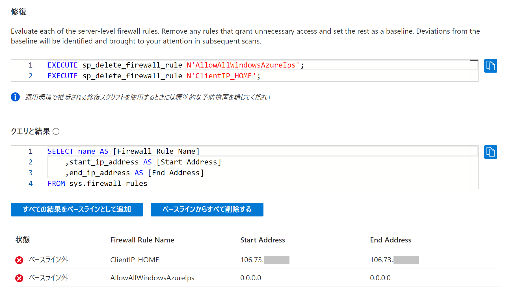
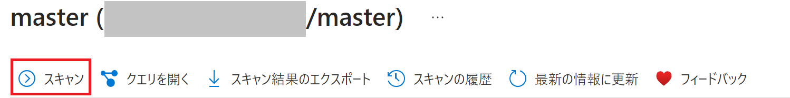

こんにちは。SQL Cloud サポート チームの陳です。

今回の投稿では、Azure SQL Database (SQL DB)、SQL Managed Instance (SQL MI) における脆弱性評価に関してよく寄せられる質問に回答します。

<!-- more -->

## 脆弱性評価とは
---

SQL DB、SQL MI の脆弱性評価はデータベースの潜在的な脆弱性を検出、追跡、修復するのに役立つ、構成が容易なサービスであり、データベースの設定が**意図通りであることの確認を促すものです**。脆弱性評価の結果によりセキュリティに影響するデータベースまたはサーバーレベルの設定を容易にレビューできます。 

脆弱性評価の定義に関して、[Azure SQL Database / SQL Managed Instance 脆弱性評価の概要と有効化/無効化の手順](vulnerabilityAssessment.md)をご参考ください。

## 脆弱性評価に関する一般的なご質問
---

1. **脆弱性評価スキャン結果に対する対処法** 

    - **VA2065**
    サーバーレベルのファイアウォール規則で全てのルール名及び許可しているIPアドレスが意図通りであることの確認を促すものです。
    サーバーレベルのファイアウォール規則を確認し、問題があれば修正または削除を行い、意図通りの設定であり問題がなければベースラインとして承認します。

    - **VA2108**
    対象ユーザーデータベースに特定の固定データベースロール(db_owner / db_accessadmin / db_backupoperator / db_ddladmin / db_securityadmin / bulkadmin)に所属するデータベースユーザーが意図通りであることの確認を促すものです。
    データベースロールの割り当てが意図されたものであり、不必要なユーザーに前述の固定データベースロールが割り当てられていないかを確認し、必要に応じて修正を行います。
    検出結果に表示される固定データベースロースに所属するユーザーが意図通りであれば、ベースラインとして承認します。

    - **VA2129**
    ストアドプロシージャやファンクションなどのオブジェクトに対する署名が変更されたかを確認することを促すものです。VA2129 通知を受け取った場合、証明付きモジュールに対し、証明書による署名に問題がない事を確認する対応します。
    尚、master データベースにて「##MS_SchemaSigningCertificate」で始まる証明書によって署名されたもの、msdb データベースにて「##MS_AgentSigningCertificate」で始まる証明書によって署名されたものは既定で存在するモジュールで、システムによって管理されている証明書となり、対応は不要ですので、ベースラインとして承認していただいて問題ございません。

    - **VA2130**
    データベースへのアクセス権を持つユーザーとして承認されているユーザー以外がデータベースに存在する場合 (ベースラインとして登録されていないユーザーが存在する場合) に、そのユーザーがアクセス権を持っていることが意図通りであることの確認を促すものです。
    検出結果内の一覧されるすべてのユーザーがアクセス権を持っていることが意図通りであれば、ベースラインとして登録し、意図通りでなければ、意図していないユーザーは削除します。

    - 以下にて脆弱性評価スキャン結果 VA2065 を例にし、具体的な対処の流れをご説明いたします。
        > - master データベースのスキャン結果より VA2065 をクリックします。
        
        
        > - 検出結果とサーバーの「ネットワーク」→「ファイアウォール」設定を比較します。

        

        
        

        > - 本環境では、ルール名 "ClientIP_HOME" で許可されている IP 106.73.xxx.xxx および、"Azure サービスおよびリソースにこのサーバーへのアクセスを許可する" の有効化は想定された設定であるため、「すべての結果をベースラインとして追加」を選択し、ベースラインとして承認します。
        
        
        > - ベースラインの変更を行ったため、更新された結果を表示するには、新たにスキャンを実行します。
        

2. **SQL MI のシステムデータベースの脆弱性評価**
脆弱性評価のスキャンは SQL MI のシステムデータベースに対しては個別に手動で実行できず、ユーザーデータベースで実行された脆弱性評価スキャンと同時にスキャンされます。

3. **脆弱性評価 (クラシック構成) に利用されるストレージアカウント**
脆弱性評価の有効化により自動的に生成されるストレージアカウントは通常 sqlva で始まる名前を持ちます。対象ストレージアカウントの vulnerability-assessment コンテナーに脆弱性評価スキャンの結果とベースライン設定が保存されています。

4. **スキャン結果にあるベースラインと関連する状態の解釈 (クラシック構成)**
脆弱性評価スキャンを実施する際にデータベースで実際の設定値とベースラインの設定を比べます。データベースでの設定とベースラインの設定を比べる時、以下の３つの状態が発生する可能性があります。

各状態の意味は以下の通りです。
「**ベースライン内**」は、該当結果はデータベースに存在し、ベースラインとして設定されています。
「**ベースライン外**」は、該当結果はデータベースに存在するものの、ベースラインとして追加されていません。
「**ベースラインの不一致**」は、該当結果はベースラインとして追加されているものの、データベースには存在していません。
